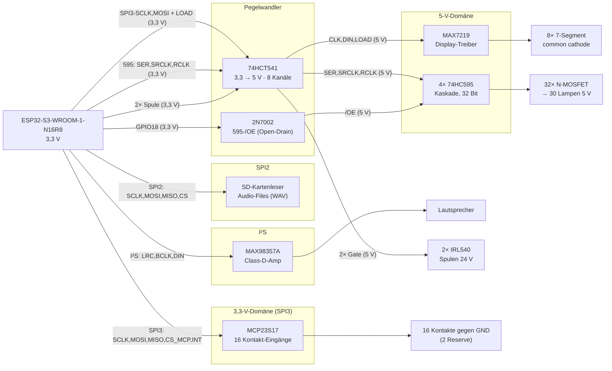

# Steuerplatine Kegelautomat – Funktionsweise & Portbelegung

**Projekt:** Nachbau der Steuerung eines Wandkegelautomaten „Bowling de Luxe / Mini Sport Kegler" (Fa. Dibisch, ~1970er)
**Zentrale Steuerung:** ESP32-S3-WROOM-1-N16R8
**Stand:** 2026-07-14

> **Wechsel C3 → S3:** Der ursprüngliche Entwurf nutzte einen ESP32-C3 Super Mini mit
> LEDC-PWM-Sound. Weil die Audioqualität nicht überzeugte, läuft die Steuerung jetzt auf
> einem **ESP32-S3-WROOM-1-N16R8**. Der größere Pin-Vorrat erlaubt echten Ton per
> **MAX98357A (I²S)** von **SD-Karte** sowie eine sauberere Bus-Aufteilung
> (zwei SPI-Busse statt eines gemeinsamen).

---

## 1. Übersicht & Zielsetzung

Der Automat ist ein Wandgerät, bei dem mit einem Hebel Kugeln „eingeschossen" werden, um möglichst viele Kegel umzuwerfen. Die Steuerplatine bildet den originalen Spielablauf nach. Anzusteuern / auszuwerten sind:

| Menge | Element | Elektrische Eigenschaft |
|------:|---------|-------------------------|
| 30×   | Lampen (Kegel-Symbole u. a.) | 5 V, geschaltet gegen **GND** (Low-Side) |
| 16×   | Kontakt-Eingänge (Einzelkontakte, keine Matrix) | schalten gegen **GND**; **2 als Reserve** |
| 2×    | Spulen (Münz-Weiche) | 24 V, geschaltet gegen **GND** (Low-Side) |
| 8×    | 7-Segment-Displays (Punkte) | **common cathode** |
| +     | **Sound** (Zusatz, kein Originalteil) | Audio-Files von SD → **MAX98357A (I²S)** → Lautsprecher |

**Ergebnis der Verifikation:** Alle Komponenten sind mit dem ESP32-S3 steuerbar. Es gibt **zwei getrennte SPI-Busse** – **SPI2** für den SD-Kartenleser (Audio), **SPI3** für MAX7219 (Displays) + MCP23S17 (Kontakte) – dazu einen **I²S**-Zweig für den Ton und **dedizierte IOs** für die Lampen-Kaskade. Ein **74HCT541** pegelt die 3,3-V-Ausgänge auf 5 V für die 5-V-Bausteine. Details und die elektrischen Fallstricke (mit Lösung) siehe Abschnitt 3.

---

## 2. Systemarchitektur

Der ESP32-S3 ist Master aller Busse:

- **SPI2** (Host): SD-Kartenleser – hoher Durchsatz für Audio-Files, entkoppelt vom Rest.
- **SPI3** (Host): MAX7219 + MCP23S17 an einem gemeinsamen Bus (SCLK/MOSI geteilt), je eigene CS-Leitung; nur der MCP nutzt **MISO**.
- **I²S**: MAX98357A (LRC, BCLK, DIN).
- **Dedizierte IOs**: 74HC595-Kaskade (SER, SRCLK, RCLK) – vom Display-Bus entkoppelt; `/OE` über einen 2N7002.
- **2 direkte GPIOs**: Spulen (→ 74HCT541 → IRL540).



**Warum SPI3 gemeinsam funktioniert:** Nur der Baustein, dessen CS/LOAD aktiviert wird, übernimmt die Daten. SCK/MOSI treiben parallel den 74HCT541-Eingang (→ MAX7219, 5 V) **und** direkt den MCP23S17 (3,3 V) – ein 3,3-V-Ausgang auf zwei 3,3-V-Lasten, unkritisch. Die Lampen-Kaskade hängt an eigenen IOs und wird davon gar nicht berührt.

---

## 3. Spannungsdomänen & Pegelkonzept

Die Platine hat **drei Spannungsdomänen**:

| Domäne | Versorgt | Anmerkung |
|--------|----------|-----------|
| 3,3 V  | ESP32-S3, MCP23S17, MAX98357A-Logik | Logik-Master |
| 5 V    | 74HCT541, 4×74HC595, MAX7219, Lampen, MAX98357A-Endstufe | Treiber, Anzeige, Ton |
| 24 V   | Spulen (über IRL540) | nur Leistungspfad |

### 3.1 Das Kernproblem: 3,3-V-Logik an 5-V-Bausteinen

Der ESP32-S3 gibt an seinen GPIOs nur **3,3 V** aus. Mehrere 5-V-Bausteine verlangen aber eine höhere High-Schwelle (V_IH). Aus den Datasheets:

| Baustein | V_IH (min, garantiert) | Bei 3,3 V vom ESP? | Quelle |
|----------|------------------------|--------------------|--------|
| **MAX7219** (V+ = 5 V) | **3,5 V** | ✗ unter Schwelle (out of spec) | `max7219-max7221.pdf`, Electrical Characteristics |
| **74HC595** (VCC = 5 V) | ≈ **3,5 V** (0,7·VCC) | ✗ grenzwertig | 74HC595 Standard-Datasheet |
| **MCP23S17** (VDD = 5 V) | **0,8·VDD = 4,0 V** | ✗ unsicher | `MCP23S17_MIC.pdf`, DC Characteristics (D041) |
| **MCP23S17** (VDD = 3,3 V) | **0,8·VDD = 2,64 V** | ✓ sicher | ″ |

### 3.2 Lösungskonzept

1. **MCP23S17 mit 3,3 V betreiben.** Dann liegt V_IH bei 2,64 V → die 3,3-V-SPI-Signale des ESP werden sicher erkannt. Die SPI-Leitungen zum MCP gehen **direkt** (ungepuffert), MISO/INT kommen mit 3,3 V zurück (ESP-konform). Betriebsspannungsbereich des MCP23S17: 1,8–5,5 V (Datasheet), 3,3 V ist zulässig.

2. **74HCT541 als Pegelwandler 3,3 V → 5 V** für alle Leitungen, die in die 5-V-Bausteine gehen. Der HCT-Eingang erkennt 3,3 V sicher als High (V_IH,HCT = 2,0 V) und treibt am Ausgang volle 5 V. Das löst **MAX7219** und **74HC595** in einem Rutsch.

3. **595 mit 5 V betreiben** – dadurch liefern die 595-Ausgänge 5 V an die Lampen-MOSFET-Gates (sauberes Durchschalten der Logic-Level-MOSFETs).

4. **IRL540-Gate-Ansteuerung ebenfalls über den 74HCT541.** Die 2 Spulen-Steuersignale kommen als 3,3-V-Ausgang direkt aus dem ESP32-S3 (GPIO21/47) und werden im 74HCT541 auf 5 V gepegelt → volle Gate-Spannung an den IRL540. Das behebt die grenzwertige 3,3-V-Gate-Ansteuerung.

5. **595-`/OE` über einen 2N7002 (Open-Drain)** statt über den 74HCT541 – so bleibt der Pegelwandler bei **einem** IC. Details in Abschnitt 6.1.

> **Ergebnis:** Der eine 74HCT541 ist mit **8 von 8 Kanälen** belegt: SPI3-SCLK, SPI3-MOSI, MAX-LOAD, 595-SER/-SRCLK/-RCLK + 2 Spulen-Gate-Signale. `/OE` läuft separat über den 2N7002. Siehe Abschnitt 6.

---

## 4. ESP32-S3: GPIO-Eigenschaften & Boot-Beschränkungen

Das Modul **ESP32-S3-WROOM-1-N16R8** (16 MB Flash, **8 MB Octal-PSRAM**) führt GPIO **0–21** und **38–48** heraus (GPIO 22–25 existieren nicht). Gesperrt bzw. mit Vorsicht:

| GPIO | Besonderheit | Konsequenz |
|------|--------------|------------|
| **33–37** | **Octal-PSRAM** (wegen „R8") intern belegt | **nie verwenden** |
| **26–32** | SPI-Flash | nicht verwendbar |
| **19, 20** | **USB D-/D+** (nativ, USB-Serial/JTAG) | Konsole/Programmierung → frei halten |
| **43, 44** | **UART0** TX/RX | Debug-Konsole → frei halten |
| **0** | Strapping (Boot) + BOOT-Taster | reserviert |
| **3** | Strapping (JTAG-Quellwahl) | unkritisch bei USB-JTAG; hier I²S-LRC (nur „weiche" DIP-Beschaltung) |
| **45** | Strapping (VDD_SPI) | nicht für Peripherie |
| **46** | Strapping (Boot/ROM-Messages) | nicht für Peripherie |

**Wichtig:**
- Strapping-Pins (0, 3, 45, 46) beim Boot in ihrem definierten Zustand belassen.
- Der ESP32-S3 hat **keine Input-only-Pins** – alle nutzbaren GPIOs sind bidirektional.
- **Nicht 5-V-tolerant:** kein GPIO darf über ~3,6 V gezogen werden (relevant für 595-`/OE`, siehe 6.1).

---

## 5. ESP32-S3 Portbelegung

| GPIO | Signal | Richtung | Verbindung | Hinweis |
|------|--------|:--------:|------------|---------|
| **1**  | SD **/CS**  | OUT | → SD-Kartenleser | SPI2 |
| **2**  | SD **MOSI** | OUT | → SD-Kartenleser | SPI2 |
| **38** | SD **CLK**  | OUT | → SD-Kartenleser | SPI2 |
| **48** | SD **MISO** | IN  | ← SD-Kartenleser | SPI2 |
| **3**  | I²S **LRC** (+DIP1) | OUT/IN | → MAX98357A LRC | Strapping-Pin; DIP1 gemultiplext |
| **9**  | I²S **BCLK** (+DIP2) | OUT/IN | → MAX98357A BCLK | DIP2 gemultiplext |
| **10** | I²S **DIN** (+DIP3) | OUT/IN | → MAX98357A DIN | DIP3 gemultiplext |
| **4**  | **ADJUST**-Taster | IN | Taster gegen GND | Bedienung |
| **5**  | **SET**-Taster | IN | Taster gegen GND | Bedienung |
| **12** | **DIP-Read-Enable** | OUT | → DIP-Puffer (Tri-State) | gibt DIP1-3 auf 3/9/10 frei |
| **11** | SPI3 **SCLK** | OUT | → 74HCT541 (→MAX) **und** direkt → MCP | HW-SPI3-Takt |
| **13** | SPI3 **MOSI** | OUT | → 74HCT541 (→MAX) **und** direkt → MCP | |
| **14** | SPI3 **MISO** | IN | ← MCP23S17 SO (3,3 V) | nur MCP treibt MISO |
| **15** | **MAX7219 LOAD** (CS) | OUT | → 74HCT541 → MAX7219 | Display-Latch |
| **16** | **MCP23S17 /CS** | OUT | → MCP23S17 CS (3,3 V) | Pull-up nach 3,3 V |
| **17** | **MCP23S17 INT** | IN | ← MCP INTA/INTB (gespiegelt) | 1 Interrupt-Leitung |
| **6**  | **74HC595 SER** | OUT | → 74HCT541 → 595 (Daten) | dedizierte Lampen-IOs |
| **7**  | **74HC595 SRCLK** | OUT | → 74HCT541 → 595 (Schiebetakt) | |
| **8**  | **74HC595 RCLK** | OUT | → 74HCT541 → 595 (Latch) | |
| **18** | **74HC595 /OE** | OUT | → 2N7002 → 595 `/OE` | invertiert; HIGH = Lampen an (siehe 6.1) |
| **21** | **Spule 1** | OUT | → 74HCT541 → IRL540 #1 | |
| **47** | **Spule 2** | OUT | → 74HCT541 → IRL540 #2 | |
| 0 | BOOT | — | BOOT-Taster | reserviert |
| 19/20 | USB | — | USB-Serial/JTAG | Konsole/Flash |
| 43/44 | UART0 | — | Debug | frei/Debug |

**Festverdrahtete Steuerpins (kein GPIO nötig):**
- MCP23S17 `/RESET` → fest auf **3,3 V** (Pull-up 10 kΩ).
- 74HC595 `/SRCLR` (Master Reset) → fest auf **5 V**.
- 74HCT541 `/OE1`, `/OE2` (Pin 1 + 19) → **GND** (Buffer immer aktiv).
- MAX98357A `SD_MODE`/`GAIN` → per Widerstand (Kanalwahl (L+R)/2, Gain nach Wunsch).

> Alle **12** zuvor freien GPIOs (6,7,8,11,13,14,15,16,17,18,21,47) sind belegt → **0 Reserve** am ESP. Zusätzlich frei bleiben nur die System-Pins (USB/UART/Boot). Am MCP23S17 stehen **2 Reserve**-Eingänge zur Verfügung.

---

## 6. 74HCT541 – Kanalbelegung (Pegelwandler 3,3 V → 5 V)

Oktal-Buffer, nicht invertierend. Eingänge 3,3-V-tauglich (HCT), Ausgänge treiben 5 V. Versorgung: **5 V**. `/OE1` (Pin 1) und `/OE2` (Pin 19) auf GND.

| Kanal | Eingang (3,3 V) von | Ausgang (5 V) nach | Funktion |
|:-----:|---------------------|--------------------|----------|
| 1 | ESP GPIO11 (SPI3-SCLK) | MAX7219 CLK | Display-Takt |
| 2 | ESP GPIO13 (SPI3-MOSI) | MAX7219 DIN | Display-Daten |
| 3 | ESP GPIO15 (LOAD) | MAX7219 LOAD | Display-Latch |
| 4 | ESP GPIO6 (SER) | 595 SER | Lampen-Daten |
| 5 | ESP GPIO7 (SRCLK) | 595 SRCLK | Lampen-Schiebetakt |
| 6 | ESP GPIO8 (RCLK) | 595 RCLK | Lampen-Latch |
| 7 | ESP GPIO21 | IRL540 #1 Gate | Spule 1 |
| 8 | ESP GPIO47 | IRL540 #2 Gate | Spule 2 |

Alle 8 Kanäle belegt. Die SPI3-Leitungen SCLK/MOSI gehen **zusätzlich** direkt (ungepuffert, 3,3 V) an den MCP23S17. Die Mischung aus schnellem Takt und langsamen DC-Spulensignalen in einem Baustein ist unkritisch.

### 6.1 595-`/OE` über 2N7002 (statt 9. Kanal)

Würde `/OE` ebenfalls über den 74HCT541 laufen, wären **9** Leitungen nötig → ein zweiter IC. Stattdessen ein **2N7002** (kleiner logic-level N-MOSFET) als Open-Drain-Treiber:

```
ESP GPIO18 ──[ 10k Pulldown → GND ]
     │
     └──► Gate 2N7002      Drain ──┬──► 595 /OE
                                    └──[ 10k Pull-up → +5 V ]
                           Source ──► GND
```

- **GPIO18 HIGH** → FET leitet → `/OE` = LOW → **Lampen aktiv**.
- **GPIO18 LOW / Boot (Hi-Z)** → FET sperrt → Pull-up zieht `/OE` = 5 V → **Lampen aus**.
- Der Gate-Pulldown sorgt beim Boot (GPIO18 noch Eingang) für sicheres Sperren → **Boot-Blanking bleibt erhalten**.
- Der ESP-Pin sieht nie 5 V (durch den FET entkoppelt) → kein Problem mit fehlender 5-V-Toleranz.
- **PWM-Dimmen** weiter möglich (invertiertes Duty auf GPIO18); Anstiegsflanke über das RC aus Pull-up + Gate-Kapazität – für globale Lampenhelligkeit unkritisch.

> **Achtung Firmware:** Die Logik ist **invertiert** – GPIO18 = HIGH schaltet die Lampen **ein**.

---

## 7. 74HC595-Kaskade – Lampen (32 Ausgänge, 30 genutzt)

**Aufbau:** 4× 74HC595 in Reihe (QH' → SER des nächsten) = **32-Bit-Schieberegister**. Versorgung **5 V**. Jeder Ausgang treibt das Gate eines kleinen **Logic-Level-N-MOSFET** (z. B. 2N7002 / AO3400), der die zugehörige Lampe **low-side** gegen GND schaltet. Lampen-Pluspol liegt fest auf 5 V. Angesteuert über **eigene, dedizierte ESP-IOs** (nicht am SPI3-Bus).

**Signale:**
- `SER` ← 74HCT541 (GPIO6, 5 V) – Daten
- `SRCLK` ← 74HCT541 (GPIO7, 5 V) – Schiebetakt
- `RCLK` ← 74HCT541 (GPIO8, 5 V) – Übernahme ins Ausgangs-Latch
- `/OE` ← 2N7002 (GPIO18, 5 V) – LOW = Ausgänge aktiv, HIGH = alle Ausgänge hochohmig (siehe 6.1)
- `/SRCLR` → fest 5 V

**Bit-Zuordnung (Vorschlag):**

| 595 | Bit (Q) | Lampen |
|-----|---------|--------|
| IC1 (erstes im Bus) | Q0…Q7 | Lampe 1–8 |
| IC2 | Q0…Q7 | Lampe 9–16 |
| IC3 | Q0…Q7 | Lampe 17–24 |
| IC4 (letztes) | Q0…Q7 | Lampe 25–30, **Q6/Q7 = Reserve** |

> **30 von 32 Ausgängen genutzt**, 2 Reserve.

**Wichtig – definierter Aus-Zustand:**
- Jedes MOSFET-Gate braucht einen **Pulldown (z. B. 100 kΩ)** nach GND. Solange `/OE` HIGH ist (Boot) sind die 595-Ausgänge hochohmig – der Pulldown hält das Gate sicher LOW → Lampe aus.
- **5-V-Strombudget:** 30 Lampen × Lampenstrom. Bei z. B. 100 mA/Lampe = bis zu 3 A. Das 5-V-Netzteil und die Leiterbahnen entsprechend dimensionieren (siehe Abschnitt 12).

**Ansteuerung:** Da die Kaskade an eigenen IOs hängt, kann das 32-Bit-Muster jederzeit unabhängig von Display-/Kontakt-Transfers geschoben und mit `RCLK` übernommen werden (per SW-SPI / Bit-Bang – 32 Bit sind unkritisch schnell).

---

## 8. MAX7219 – Displays (8× 7-Segment, common cathode)

Der MAX7219 ist ein serieller Anzeigentreiber für bis zu **8 Digits common cathode** – passt exakt zu den 8 Punktedisplays. Versorgung **V+ = 5 V** (Bereich 4,0–5,5 V). Angebunden am **SPI3-Bus** (gemeinsam mit dem MCP23S17, eigene LOAD-Leitung).

**Signale (alle 5 V, aus dem 74HCT541):**
- `DIN` ← SPI3-MOSI (GPIO13)
- `CLK` ← SPI3-SCLK (GPIO11)
- `LOAD` ← GPIO15

**Beschaltung / Konfiguration:**
- **RSET** zwischen V+ und ISET setzt den Segment-Spitzenstrom; Minimum 9,53 kΩ (≈ 40 mA). Wert nach gewünschter Helligkeit / Display-Datenblatt wählen.
- **Scan-Limit-Register** = 7 (→ 8 Digits aktiv).
- **Decode-Mode**: Code-B für reine Ziffernanzeige, oder No-Decode für individuelle Segmentsteuerung.
- **Intensity-Register**: digitale Helligkeit (16 Stufen).
- **Shutdown-Register**: nach Power-up ist die Anzeige geblankt – im Setup aktiv schalten.

**Hinweis Logikpegel:** Die 5-V-Ansteuerung über den 74HCT541 stellt sicher, dass die 3,5-V-V_IH-Schwelle des MAX7219 sicher überschritten wird (siehe Abschnitt 3). Ohne den Pegelwandler wäre der Betrieb mit 3,3 V außerhalb der Spezifikation.

---

## 9. MCP23S17 – Kontakte (16 Eingänge)

SPI-Port-Expander mit **16 IO** (Port A: GPA0–7, Port B: GPB0–7). Versorgung **3,3 V** (damit 3,3-V-SPI direkt funktioniert, siehe Abschnitt 3). SPI-Signale (SCK, SI=MOSI, SO=MISO, CS) **ungepuffert** direkt zum ESP am **SPI3-Bus**. Alle 16 IO dienen jetzt als **Kontakt-Eingänge** (die Spulen liegen nicht mehr am MCP, sondern direkt am ESP – siehe Abschnitt 9.3).

### 9.1 IO-Belegung

| Pin | Funktion | Richtung | Beschaltung |
|-----|----------|:--------:|-------------|
| GPA0–GPA7 | Kontakt 1–8 | IN | interner Pull-up, schaltet gegen GND |
| GPB0–GPB5 | Kontakt 9–14 | IN | interner Pull-up, schaltet gegen GND |
| GPB6, GPB7 | **Reserve** | – | frei |

> **Bilanz:** 14 Kontakte + **2 Reserve** = 16 IO. (Der C3-Entwurf hatte hier 12 Kontakte + 3 Spulen; die Spulen sind ausgezogen, dadurch mehr Kontakt-Kapazität.)

### 9.2 Kontakt-Erfassung per Interrupt

- Alle Eingänge mit **internem Pull-up** (`GPPU` = 1). Ein geschlossener Kontakt zieht den Pin auf GND.
- **Interrupt-on-Change** (`GPINTEN` = 1, Vergleich gegen Vorwert) meldet jede Kontaktänderung.
- **INTA/INTB gespiegelt** (`IOCON.MIRROR` = 1) → beide Ports lösen **eine** gemeinsame INT-Leitung aus. Das spart einen ESP-Pin; der ISR liest anschließend per SPI `INTF`/`INTCAP`/`GPIO` beider Ports und ermittelt den geänderten Kontakt.
- Der ESP reagiert auf die INT-Flanke an **GPIO17**.

### 9.3 Spulen-Leistungsteil (IRL540, direkt vom ESP)

- **ESP-Ausgang** (GPIO21/47) HIGH → 74HCT541 (5 V) → **IRL540-Gate** → Spule (24 V) low-side eingeschaltet.
- **Gate-Pulldown (z. B. 10 kΩ)** je IRL540 → definierter Aus-Zustand bei Boot / vor Firmware-Init (die ESP-Ausgänge sind vor der Init hochohmige Eingänge).
- **Freilaufdiode zwingend** je Spule (z. B. UF4007/1N4007, Kathode an +24 V, Anode an Drain) – schützt den IRL540 vor der Induktionsspannung beim Abschalten.

---

## 10. Bus-Betrieb

Alle SPI-Bausteine arbeiten im **SPI-Mode 0** (CPOL=0, CPHA=0).

**SPI2 – SD-Karte (eigener Host):** dediziert, damit das Lesen der Audio-Files das Display-/Kontakt-Timing nicht blockiert. Eigene MISO (GPIO48), CS (GPIO1).

**SPI3 – MAX7219 + MCP23S17 (gemeinsamer Host):** SCLK (GPIO11) und MOSI (GPIO13) sind geteilt; je eigene Auswahlleitung:
- **MCP23S17**: echtes `/CS` (GPIO16). Reagiert nur bei aktivem CS.
- **MAX7219**: `LOAD` (GPIO15). Schiebt bei jedem CLK, übernimmt aber erst mit steigender `LOAD`-Flanke.
- **MISO** (GPIO14): nur der MCP23S17 treibt MISO (und nur bei aktivem CS). Der MAX7219-`DOUT` wird **nicht** auf den ESP-MISO geführt → keine Bus-Kollision.

**Lampen (74HC595) – eigene IOs:** vollständig vom SPI3-Bus entkoppelt. Es wird **kein** Fremd-Takt in die Kaskade eingeschoben; ein `RCLK`-Puls nach dem vollständigen 32-Bit-Frame macht das Muster sichtbar.

**I²S – MAX98357A:** separater Peripherie-Block (LRC/BCLK/DIN), unabhängig von SPI.

---

## 11. Boot- & Sicherheitsverhalten

Definierte, ungefährliche Zustände von Power-on bis Firmware-Init:

| Element | Maßnahme | Zustand beim Boot |
|---------|----------|-------------------|
| Lampen | 2N7002 sperrt (Gate-Pulldown) → 595-`/OE` per Pull-up auf 5 V → Ausgänge hochohmig + Gate-Pulldowns | **alle aus** |
| Spulen | IRL540-Gate-Pulldowns; ESP-Ausgänge (21/47) nach Reset hochohmig | **alle aus** |
| Display | MAX7219 startet im Shutdown (Datasheet) | **dunkel** |
| MCP | `/RESET` fest auf 3,3 V; Register-Defaults = alle Pins Eingang | keine ungewollten Ausgänge |
| Sound | I²S-Pins vor Init hochohmig; MAX98357A liefert ohne Takt kein Signal | **still** |
| Strapping | GPIO0/3/45/46 in definiertem Zustand | normaler Flash-Boot |

---

## 12. Offene Punkte & Empfehlungen

1. **5-V-Netzteil dimensionieren** – bestimmt durch den Summenstrom der 30 Lampen (Lampenstrom messen) plus MAX98357A-Spitzen. Reserve einplanen.
2. **Freilaufdioden** an beiden Spulen nicht vergessen (24 V, induktiv).
3. **IRL540 real prüfen:** Spulenstrom messen und gegen die Transfer-Kennlinie bei V_GS = 5 V gegenchecken. Bei hohen Strömen ggf. auf einen MOSFET mit niedrigerem R_DS(on) bei 5 V wechseln.
4. **Entkopplung:** je IC 100 nF nahe an VCC/VDD; zusätzlich Elkos an den 5-V- und 24-V-Rails. Getrennte GND-Führung (Leistungs-GND der Lampen/Spulen **und** Audio-GND sternförmig zum Logik-GND).
5. **Reserve:** am ESP **0** (alle 12 freien Pins belegt), am MCP23S17 **2** Eingänge frei (GPB6/7).
6. **DIP-Multiplexing prüfen:** DIP1-3 liegen auf den I²S-Leitungen (3/9/10), freigegeben über GPIO12. Die DIPs nur einlesen, wenn I²S ruht (z. B. beim Start); der DIP-Puffer muss im I²S-Betrieb sicher **hochohmig** sein, damit er die Audio-Leitungen nicht belastet.
7. **595-`/OE` invertiert:** Firmware beachten – GPIO18 = HIGH schaltet Lampen ein (2N7002, siehe 6.1).
8. **Kontakte physisch:** Endgültige Pin-Zuordnung der Kontakte auf die Steckerleisten in der Verdrahtungsdoku festlegen.
9. **Audio:** SD-Karten-Slot, MAX98357A-Modul (Gain/Kanal per Widerstand) und Lautsprecher einplanen; Details in Abschnitt 13.

---

## 13. Soundausgabe (MAX98357A über I²S, Files von SD-Karte)

Der frühere LEDC-PWM-Ansatz (Rechteck-Ton auf einem GPIO + analoger Verstärker, z. B. TDA7267) wird ersetzt: Der Ton kommt jetzt als **echte Audio-Datei von SD-Karte**, wird vom ESP32-S3 dekodiert/gestreamt und über **I²S** an einen **MAX98357A** (Class-D-Mono-Verstärker) ausgegeben. Das liefert deutlich bessere Klangqualität als der PWM-Piep und braucht **keinen** zusätzlichen Analog-Verstärker.

**Signalkette:**

```
SD-Karte (WAV) ──SPI2──► ESP32-S3 ──I²S (LRC/BCLK/DIN)──► MAX98357A ──► Lautsprecher (4–8 Ω)
```

### 13.1 MAX98357A (I²S)

- **Eingänge:** `LRC` (Word-Select, GPIO3), `BCLK` (Bit-Clock, GPIO9), `DIN` (Daten, GPIO10).
- **Versorgung:** 2,5–5,5 V; für mehr Ausgangsleistung am **5-V-Rail** betreiben (bis ~3 W an 4 Ω).
- **Ausgang:** Brücken-Endstufe direkt an den Lautsprecher – **kein** Koppelkondensator nötig.
- **`SD_MODE`-Pin:** per Widerstand konfiguriert → Kanalwahl / Shutdown; für Mono (L+R)/2 den vom Modul vorgegebenen Wert nutzen.
- **`GAIN`-Pin:** per Widerstand die Verstärkung wählen (Lautstärke-Grundpegel).

### 13.2 SD-Kartenleser (SPI2)

- **SPI-Signale:** `MISO` = GPIO48, `MOSI` = GPIO2, `CLK` = GPIO38, `CS` = GPIO1.
- Eigener SPI-Host (SPI2), damit das Nachladen der Audio-Daten das Display-/Kontakt-Timing (SPI3) nicht bremst.
- Dateisystem FAT; die Effekt-/Sound-Files (WAV) liegen als Dateien auf der Karte und lassen sich ohne Re-Flash austauschen.

### 13.3 DIP-Schalter (gemultiplext)

Drei DIP-Schalter (DIP1-3) teilen sich die I²S-Leitungen (GPIO3/9/10). Ein Puffer/Tri-State, freigegeben über **GPIO12 (READ_DIP)**, legt die DIP-Zustände nur **auf Anforderung** auf diese Leitungen – typischerweise beim Start, bevor I²S aktiv ist. Im laufenden Audio-Betrieb ist der Puffer hochohmig.

**Firmware:** Die zentralen Pin-Zuweisungen stehen in `gpiodefs.h` (I²S, SD, Taster/DIP). Die S3-Audiokette (ESP-IDF: I²S-Treiber + FATFS/SD) wird als zweiter Schritt aufgesetzt; das alte LEDC-Testprojekt unter `firmware/` bleibt vorerst als Referenz bestehen.

**Für die Platine:** SD-Slot, MAX98357A-Modul und Lautsprecher vorsehen; Analog-/Audio-GND sternförmig und getrennt vom Leistungs-GND der Lampen/Spulen führen.

---

## Anhang: Verwendete Quellen

- `Projekt_Kegelautomat.txt` – Projektbeschreibung
- `datasheets/MCP23S17_MIC.pdf` – DC-Kennwerte (V_IH = 0,8·VDD; Betrieb 1,8–5,5 V; max. 25 mA/Pin)
- `datasheets/max7219-max7221.pdf` – Electrical Characteristics (V_IH = 3,5 V @ V+ = 5 V; common cathode; 8 Digits)
- `datasheets/esp32-S3-pinout.pdf` – Pinout ESP32-S3-WROOM-1
- **MAX98357A** (Maxim/Analog Devices) – I²S-Class-D-Amp; Gain/Kanal per Widerstand (Herstellerdatenblatt, nicht mitgeliefert)
- `datasheets/PCB_Skizze.jpg`, `datasheets/Kegelautomat.jpg` – Layout-Skizze & Automat
- Espressif ESP32-S3 GPIO/Strapping-Doku – Strapping GPIO0/3/45/46, Flash 26–32, Octal-PSRAM 33–37 (N16R8), USB 19/20, UART0 43/44
