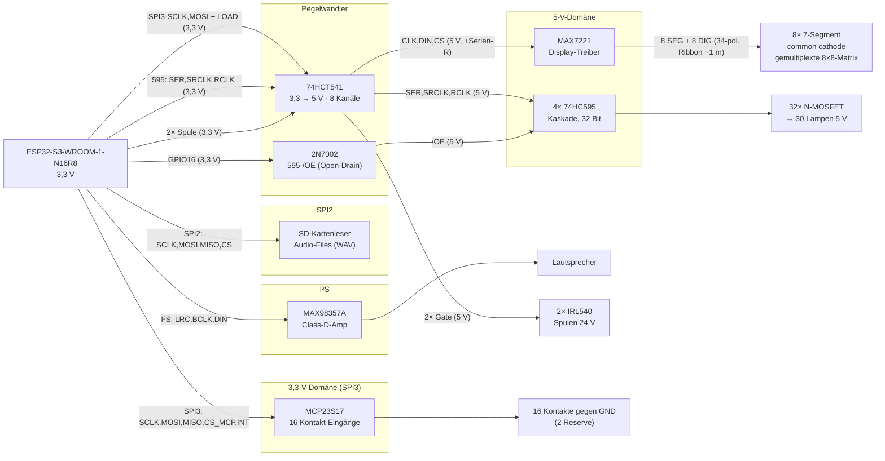

# Steuerplatine Kegelautomat – Funktionsweise & Portbelegung

**Projekt:** Nachbau der Steuerung eines Wandkegelautomaten „Bowling de Luxe / Mini Sport Kegler" (Fa. Dibisch, ~1970er)
**Zentrale Steuerung:** ESP32-S3-WROOM-1-N16R8
**Stand:** 2026-07-17

---

## 1. Übersicht & Zielsetzung

Der Automat ist ein Wandgerät, bei dem mit einem Hebel Kugeln „eingeschossen" werden, um möglichst viele Kegel umzuwerfen. Die **Kegel werden durch Lampen symbolisiert**, die erzielten **Punkte auf den 7-Segment-Displays** angezeigt. Die Steuerplatine bildet den originalen Spielablauf nach. Anzusteuern / auszuwerten sind:

| Menge | Element | Elektrische Eigenschaft |
|------:|---------|-------------------------|
| 30×   | Lampen (Kegel-Symbole u. a.) | 5 V, geschaltet gegen **GND** (Low-Side) |
| 16×   | Kontakt-Eingänge (Einzelkontakte, keine Matrix) | schalten gegen **GND**; **2 als Reserve** |
| 2×    | Spulen (Münz-Weiche) | 24 V, geschaltet gegen **GND** (Low-Side) |
| 8×    | 7-Segment-Displays (Punkte) | **common cathode** |
| +     | **Sound** (Zusatz, kein Originalteil) | Audio-Files von SD → **MAX98357A (I²S)** → Lautsprecher |

**Ergebnis der Verifikation:** Alle Komponenten sind mit dem ESP32-S3 steuerbar. Es gibt **zwei getrennte SPI-Busse** – **SPI2** für den SD-Kartenleser (Audio), **SPI3** für MAX7221 (Displays) + MCP23S17 (Kontakte) – dazu einen **I²S**-Zweig für den Ton und **dedizierte IOs** für die Lampen-Kaskade. Ein **74HCT541** pegelt die 3,3-V-Ausgänge auf 5 V für die 5-V-Bausteine. Details und die elektrischen Fallstricke (mit Lösung) siehe Abschnitt 3.

---

## 2. Systemarchitektur

Der ESP32-S3 ist Master aller Busse:

- **SPI2** (Host): SD-Kartenleser – hoher Durchsatz für Audio-Files, entkoppelt vom Rest.
- **SPI3** (Host): MAX7221 + MCP23S17 an einem gemeinsamen Bus (SCLK/MOSI geteilt), je eigene CS-Leitung; nur der MCP nutzt **MISO**.
- **I²S**: MAX98357A (LRC, BCLK, DIN).
- **Dedizierte IOs**: 74HC595-Kaskade (SER, SRCLK, RCLK) – vom Display-Bus entkoppelt; `/OE` über einen 2N7002.
- **2 direkte GPIOs**: Spulen (→ 74HCT541 → IRL540).



**Warum SPI3 gemeinsam funktioniert:** Nur der Baustein, dessen CS aktiviert wird, übernimmt die Daten – und der MAX7221 schiebt (anders als der MAX7219) nur bei aktivem CS. SCK/MOSI treiben parallel den 74HCT541-Eingang (→ MAX7221, 5 V) **und** direkt den MCP23S17 (3,3 V) – ein 3,3-V-Ausgang auf zwei 3,3-V-Lasten, unkritisch. Die Lampen-Kaskade hängt an eigenen IOs und wird davon gar nicht berührt.

---

## 3. Spannungsdomänen & Pegelkonzept

Die Platine hat **drei Spannungsdomänen**:

| Domäne | Versorgt | Anmerkung |
|--------|----------|-----------|
| 3,3 V  | ESP32-S3, MCP23S17, MAX98357A-Logik | Logik-Master |
| 5 V    | 74HCT541, 4×74HC595, MAX7221, Lampen, MAX98357A-Endstufe | Treiber, Anzeige, Ton |
| 24 V   | Spulen (über IRL540) | nur Leistungspfad |

### 3.1 Das Kernproblem: 3,3-V-Logik an 5-V-Bausteinen

Der ESP32-S3 gibt an seinen GPIOs nur **3,3 V** aus. Mehrere 5-V-Bausteine verlangen aber eine höhere High-Schwelle (V_IH). Aus den Datasheets:

| Baustein | V_IH (min, garantiert) | Bei 3,3 V vom ESP? | Quelle |
|----------|------------------------|--------------------|--------|
| **MAX7221** (V+ = 5 V) | **3,5 V** | ✗ unter Schwelle (out of spec) | `max7219-max7221.pdf`, Electrical Characteristics (7219/7221 identisch) |
| **74HC595** (VCC = 5 V) | ≈ **3,5 V** (0,7·VCC) | ✗ grenzwertig | 74HC595 Standard-Datasheet |
| **MCP23S17** (VDD = 5 V) | **0,8·VDD = 4,0 V** | ✗ unsicher | `MCP23S17_MIC.pdf`, DC Characteristics (D041) |
| **MCP23S17** (VDD = 3,3 V) | **0,8·VDD = 2,64 V** | ✓ sicher | ″ |

### 3.2 Lösungskonzept

1. **MCP23S17 mit 3,3 V betreiben.** Dann liegt V_IH bei 2,64 V → die 3,3-V-SPI-Signale des ESP werden sicher erkannt. Die SPI-Leitungen zum MCP gehen **direkt** (ungepuffert), MISO/INT kommen mit 3,3 V zurück (ESP-konform). Betriebsspannungsbereich des MCP23S17: 1,8–5,5 V (Datasheet), 3,3 V ist zulässig.

2. **74HCT541 als Pegelwandler 3,3 V → 5 V** für alle Leitungen, die in die 5-V-Bausteine gehen. Der HCT-Eingang erkennt 3,3 V sicher als High (V_IH,HCT = 2,0 V) und treibt am Ausgang volle 5 V. Das löst **MAX7221** und **74HC595** in einem Rutsch.

3. **595 mit 5 V betreiben** – dadurch liefern die 595-Ausgänge 5 V an die Lampen-MOSFET-Gates (sauberes Durchschalten der Logic-Level-MOSFETs).

4. **IRL540-Gate-Ansteuerung ebenfalls über den 74HCT541.** Die 2 Spulen-Steuersignale kommen als 3,3-V-Ausgang direkt aus dem ESP32-S3 (GPIO12/11) und werden im 74HCT541 auf 5 V gepegelt → volle Gate-Spannung an den IRL540. Das behebt die grenzwertige 3,3-V-Gate-Ansteuerung.

5. **595-`/OE` über einen 2N7002 (Open-Drain)** statt über den 74HCT541 – so bleibt der Pegelwandler bei **einem** IC. Details in Abschnitt 6.1.

> **Ergebnis:** Der eine 74HCT541 ist mit **8 von 8 Kanälen** belegt: SPI3-SCLK, SPI3-MOSI, MAX-CS, 595-SER/-SRCLK/-RCLK + 2 Spulen-Gate-Signale. `/OE` läuft separat über den 2N7002. Siehe Abschnitt 6.

### 3.2 5-V-Einspeisung: USB-VBUS ↔ externes Netzteil (Entkopplung)

Das 5-V-Rail wird aus **zwei** Quellen gespeist: dem **externen 5-V-Netzteil an J1** (Volllast inkl. Lampen) und **USB-VBUS** (nur beim Programmieren/Debuggen über USB-C). Damit bei gleichzeitig gestecktem USB **und** externem Netzteil nicht das eine ins andere zurückspeist (Rückstrom in den PC-Port über die PTC-Sicherung F1), ist der VBUS-Zweig **entkoppelt**:

```
USB-VBUS ──► F1 (PTC, MF-MSMF150: I_hold 1,5 A) ──► SS24 ──►┐
                                                            ├── +5-V-Rail
externes 5-V-Netzteil ─────────── J1 ──────────────────────►┘
```

- **Schottky = SS24** (2 A / 40 V, SMA). Sperrt Rückspeisung ins USB-Port; niedriger Vf (~0,3–0,4 V bei < 1 A), da der USB-Zweig nur Logik + Display + CH340 trägt (die 30 Lampen bis 3 A laufen ausschließlich über J1, hinter der Diode).
- **Orientierung:** Anode an F1-Seite (VBUS), **Kathode (Ring) am +5-V-Rail**.
- **CH340C-VCC** hängt auf der **+5-V-Rail-Seite** (nach der Diode) → sowohl bei USB- als auch bei externer Versorgung sauber versorgt.
- **Hinweis:** Im reinen USB-Betrieb (ohne J1-Netzteil) frisst der Vf ~0,3 V vom Rail. Für ESP-S3-LDO und MAX98357A unkritisch; falls die Platine mal *ausschließlich* über USB laufen soll (nicht nur flashen), Rail unter Last gegenmessen.

---

## 4. ESP32-S3: GPIO-Eigenschaften & Boot-Beschränkungen

Das Modul **ESP32-S3-WROOM-1-N16R8** (16 MB Flash, **8 MB Octal-PSRAM**) führt GPIO **0–21** und **38–48** heraus (GPIO 22–25 existieren nicht). Gesperrt bzw. mit Vorsicht:

| GPIO | Besonderheit | Konsequenz |
|------|--------------|------------|
| **33–37** | **Octal-PSRAM** (wegen „R8") intern belegt | **nie verwenden** |
| **26–32** | SPI-Flash | nicht verwendbar |
| **19, 20** | **USB D-/D+** (nativ, USB-Serial/JTAG) | auf v07 **nicht belegt** (`nc`) → frei; native USB optional nachrüstbar |
| **43, 44** | **UART0** TX/RX | auf v07 an **CH340C** (USB-UART-Brücke, Programmierung/Konsole via USB-C) |
| **0** | Strapping (Boot) + BOOT-Taster | reserviert |
| **3** | Strapping (JTAG-Quellwahl) | unkritisch bei USB-JTAG; hier 74HC595-`SER` (reiner Ausgang, kein externer Treiber) – Pulldown empfohlen |
| **45** | Strapping (VDD_SPI) | nicht für Peripherie |
| **46** | Strapping (Boot/ROM-Messages) | nicht für Peripherie |

**Wichtig:**
- Strapping-Pins (0, 3, 45, 46) beim Boot in ihrem definierten Zustand belassen.
- Der ESP32-S3 hat **keine Input-only-Pins** – alle nutzbaren GPIOs sind bidirektional.
- **Nicht 5-V-tolerant:** kein GPIO darf über ~3,6 V gezogen werden (relevant für 595-`/OE`, siehe 6.1).

---

## 5. ESP32-S3 Portbelegung

| GPIO | Signal | Richtung | Verbindung | Hinweis |
|------|--------|:--------:|------------|---------|
| **1**  | SD **/CS**  | OUT | → SD-Kartenleser | SPI2 |
| **2**  | SD **MOSI** | OUT | → SD-Kartenleser | SPI2 |
| **38** | SD **CLK**  | OUT | → SD-Kartenleser | SPI2 |
| **48** | SD **MISO** | IN  | ← SD-Kartenleser | SPI2 |
| **47** | I²S **LRC** (+DIP1) | OUT/IN | → MAX98357A LRC | DIP1 gemultiplext |
| **21** | I²S **BCLK** (+DIP2) | OUT/IN | → MAX98357A BCLK | DIP2 gemultiplext |
| **14** | I²S **DIN** (+DIP3) | OUT/IN | → MAX98357A DIN | DIP3 gemultiplext |
| **4**  | **ADJUST**-Taster | IN | Taster gegen GND | Bedienung |
| **5**  | **SET**-Taster | IN | Taster gegen GND | Bedienung |
| **13** | **DIP-Read-Enable** | OUT | → DIP-Puffer (Tri-State) | gibt DIP1-3 auf 47/21/14 frei |
| **17** | SPI3 **SCLK** | OUT | → 74HCT541 (→MAX) **und** direkt → MCP | HW-SPI3-Takt |
| **8**  | SPI3 **MOSI** | OUT | → 74HCT541 (→MAX) **und** direkt → MCP | |
| **7**  | SPI3 **MISO** | IN | ← MCP23S17 SO (3,3 V) | nur MCP treibt MISO |
| **18** | **MAX7221 CS** (= LOAD-Pin) | OUT | → 74HCT541 (+Serien-R) → MAX7221 | aktiv-LOW; Latch mit steigender CS-Flanke |
| **15** | **MCP23S17 /CS** | OUT | → MCP23S17 CS (3,3 V) | Pull-up nach 3,3 V |
| **6**  | **MCP23S17 INT** | IN | ← MCP **INTA** (INTB bleibt offen) | 1 INT-Leitung; `IOCON.MIRROR` = 1 (siehe 9.3) |
| **3**  | **74HC595 SER** | OUT | → 74HCT541 → 595 (Daten) | dedizierte Lampen-IOs; Strapping-Pin, Pulldown empfohlen |
| **10** | **74HC595 SRCLK** | OUT | → 74HCT541 → 595 (Schiebetakt) | |
| **9**  | **74HC595 RCLK** | OUT | → 74HCT541 → 595 (Latch) | |
| **16** | **74HC595 /OE** | OUT | → 2N7002 → 595 `/OE` | invertiert; HIGH = Lampen an (siehe 6.1) |
| **12** | **Spule 1** | OUT | → 74HCT541 → IRL540 #1 | |
| **11** | **Spule 2** | OUT | → 74HCT541 → IRL540 #2 | |
| 0 | BOOT | — | BOOT-Taster | reserviert |
| 19/20 | USB (nativ) | — | **nicht belegt (`nc`)** | native USB-Serial/JTAG optional; auf v07 frei |
| 43/44 | UART0 | OUT/IN | → **CH340C** (USB-UART) | Programmierung/Konsole via USB-C |
| 39–42 | **Reserve** | — | frei | JTAG-Pins, als GPIO nutzbar (dann kein JTAG-Debug) |

**Festverdrahtete Steuerpins (kein GPIO nötig):**
- MCP23S17 `A0`, `A1`, `A2` → fest auf **GND** (Adresse `000`, siehe Abschnitt 9.1).
- MCP23S17 `/RESET` → fest auf **3,3 V** (Pull-up 10 kΩ).
- 74HC595 `/SRCLR` (Master Reset) → fest auf **5 V**.
- 74HCT541 `/OE1`, `/OE2` (Pin 1 + 19) → **GND** (Buffer immer aktiv).
- MAX98357A `SD_MODE`/`GAIN` → per Widerstand (Kanalwahl (L+R)/2, Gain nach Wunsch).

> **Bilanz:** 22 GPIOs belegt (1–18, 21, 38, 47, 48). Frei bleiben **GPIO 39–42** → **4 Reserve** am ESP (die JTAG-Pins MTCK/MTDO/MTDI/MTMS; als GPIO nutzbar, dann entfällt JTAG-Debug – die Konsole läuft ohnehin über den CH340). Auf v07 sind **IO19/20 (native USB) nicht belegt** → zusätzlich frei; **Programmierung/Konsole laufen über die CH340C-Brücke an UART0 (43/44)** am USB-C. BOOT (0) reserviert. Am MCP23S17 stehen **2 Reserve**-Eingänge zur Verfügung.

---

## 6. 74HCT541 – Kanalbelegung (Pegelwandler 3,3 V → 5 V)

Oktal-Buffer, nicht invertierend. Eingänge 3,3-V-tauglich (HCT), Ausgänge treiben 5 V. Versorgung: **5 V**. `/OE1` (Pin 1) und `/OE2` (Pin 19) auf GND.

| Kanal | Eingang (3,3 V) von | Ausgang (5 V) nach | Funktion |
|:-----:|---------------------|--------------------|----------|
| 1 | ESP GPIO17 (SPI3-SCLK) | MAX7221 CLK | Display-Takt (Serien-R am Ausgang, siehe Abschnitt 8) |
| 2 | ESP GPIO8 (SPI3-MOSI) | MAX7221 DIN | Display-Daten (Serien-R) |
| 3 | ESP GPIO18 (CS) | MAX7221 CS | Display-Latch / Chip-Select (Serien-R) |
| 4 | ESP GPIO3 (SER) | 595 SER | Lampen-Daten |
| 5 | ESP GPIO10 (SRCLK) | 595 SRCLK | Lampen-Schiebetakt |
| 6 | ESP GPIO9 (RCLK) | 595 RCLK | Lampen-Latch |
| 7 | ESP GPIO12 | IRL540 #1 Gate | Spule 1 |
| 8 | ESP GPIO11 | IRL540 #2 Gate | Spule 2 |

Alle 8 Kanäle belegt. Die SPI3-Leitungen SCLK/MOSI gehen **zusätzlich** direkt (ungepuffert, 3,3 V) an den MCP23S17. Die Mischung aus schnellem Takt und langsamen DC-Spulensignalen in einem Baustein ist unkritisch.

### 6.1 595-`/OE` über 2N7002 (statt 9. Kanal)

Würde `/OE` ebenfalls über den 74HCT541 laufen, wären **9** Leitungen nötig → ein zweiter IC. Stattdessen ein **2N7002** (kleiner logic-level N-MOSFET) als Open-Drain-Treiber:

```
ESP GPIO16 ──[ 10k Pulldown → GND ]
     │
     └──► Gate 2N7002      Drain ──┬──► 595 /OE
                                    └──[ 10k Pull-up → +5 V ]
                           Source ──► GND
```

- **GPIO16 HIGH** → FET leitet → `/OE` = LOW → **Lampen aktiv**.
- **GPIO16 LOW / Boot (Hi-Z)** → FET sperrt → Pull-up zieht `/OE` = 5 V → **Lampen aus**.
- Der Gate-Pulldown sorgt beim Boot (GPIO16 noch Eingang) für sicheres Sperren → **Boot-Blanking bleibt erhalten**.
- Der ESP-Pin sieht nie 5 V (durch den FET entkoppelt) → kein Problem mit fehlender 5-V-Toleranz.
- **PWM-Dimmen** weiter möglich (invertiertes Duty auf GPIO16); Anstiegsflanke über das RC aus Pull-up + Gate-Kapazität – für globale Lampenhelligkeit unkritisch.

> **Achtung Firmware:** Die Logik ist **invertiert** – GPIO16 = HIGH schaltet die Lampen **ein**.

---

## 7. 74HC595-Kaskade – Lampen (32 Ausgänge, 30 genutzt)

**Aufbau:** 4× 74HC595 in Reihe (QH' → SER des nächsten) = **32-Bit-Schieberegister**. Versorgung **5 V**. Jeder Ausgang treibt das Gate eines kleinen **Logic-Level-N-MOSFET** (z. B. 2N7002 / AO3400), der die zugehörige Lampe **low-side** gegen GND schaltet. Lampen-Pluspol liegt fest auf 5 V. Angesteuert über **eigene, dedizierte ESP-IOs** (nicht am SPI3-Bus).

**Signale:**
- `SER` ← 74HCT541 (GPIO3, 5 V) – Daten
- `SRCLK` ← 74HCT541 (GPIO10, 5 V) – Schiebetakt
- `RCLK` ← 74HCT541 (GPIO9, 5 V) – Übernahme ins Ausgangs-Latch
- `/OE` ← 2N7002 (GPIO16, 5 V) – LOW = Ausgänge aktiv, HIGH = alle Ausgänge hochohmig (siehe 6.1)
- `/SRCLR` → fest 5 V

**Bit-Zuordnung (Vorschlag):**

| 595 | Bit (Q) | Lampen |
|-----|---------|--------|
| IC1 (erstes im Bus) | Q0…Q7 | Lampe 1–8 |
| IC2 | Q0…Q7 | Lampe 9–16 |
| IC3 | Q0…Q7 | Lampe 17–24 |
| IC4 (letztes) | Q0…Q7 | Lampe 25–30, **Q6/Q7 = Reserve** |

> **30 von 32 Ausgängen genutzt**, 2 Reserve.

**Wichtig – definierter Aus-Zustand:**
- Jedes MOSFET-Gate braucht einen **Pulldown (z. B. 100 kΩ)** nach GND. Solange `/OE` HIGH ist (Boot) sind die 595-Ausgänge hochohmig – der Pulldown hält das Gate sicher LOW → Lampe aus.
- **5-V-Strombudget:** 30 Lampen × Lampenstrom. Bei z. B. 100 mA/Lampe = bis zu 3 A. Das 5-V-Netzteil und die Leiterbahnen entsprechend dimensionieren (siehe Abschnitt 12).

**Ansteuerung:** Da die Kaskade an eigenen IOs hängt, kann das 32-Bit-Muster jederzeit unabhängig von Display-/Kontakt-Transfers geschoben und mit `RCLK` übernommen werden (per SW-SPI / Bit-Bang – 32 Bit sind unkritisch schnell).

---

## 8. MAX7221 – Displays (8× 7-Segment, common cathode, gemultiplext)

### 8.1 Die vorhandene Display-Architektur (aus `datasheets/Display.jpg`)

Die 8 Ziffern sind **fest als gemultiplexte 8×8-Matrix** verdrahtet – nicht statisch. Das gibt der Original-Stecker (`K6`, 34-poliger Wannenstecker) vor:

| Ribbon-Pins | Signal | Bedeutung |
|-------------|--------|-----------|
| 19, 21, 23, 25, 27, 29, 31, 33 (ungerade) | 19=dP2, 21=g, 23=f, 25=e, 27=d, 29=c, 31=b, **33=a** | **8 Segmentleitungen**, über alle Ziffern gemeinsam (Segment-Bus) – Reihenfolge **absteigend** (dP2→a) laut `Display.jpg`, so auch im Schaltplan verdrahtet |
| 2, 4, 6, 8, 10, 12, 14, 16 (gerade) | Bip 1er/10er · Credit 1er/10er · Score 1er/10er/100er/1000er | **8 Digit-Auswahlleitungen** (je ein Common pro Ziffer) |
| dazwischenliegende Pins | GND / Rückleiter | Signal–GND–Signal–GND verschachtelt |

- Die 8 Ziffern liegen physisch auf **3 Platinen** (2× Bip, 2× Credit, 4× Score = **2×2 + 1×4**), alle über **ein ~1 m langes 34-poliges Flachbandkabel** angebunden.
- Segmente über alle Ziffern zusammengefasst → **klassische Multiplex-Matrix** (8 SEG + 8 DIG) = exakt die MAX7221-Topologie. Statischer Betrieb wäre für das lange Kabel elektrisch besser, ist mit dieser Verdrahtung aber **nicht** möglich (bräuchte 64 Einzel-Segmentleitungen und neue Display-Platinen).
- **Wichtig:** Die verschachtelten Masse-Rückleiter des 34-poligen Bands sind kein Zufall – sie geben dem Flachband ~100–130 Ω Wellenwiderstand und machen Multiplex über ~1 m erst gutmütig. **Beim Neuaufbau beibehalten.**

### 8.2 Warum MAX7221 statt MAX7219 (Variante B)

Der Treiber bleibt auf der **Hauptplatine**, die 16 Matrixleitungen laufen über die ~1 m des Bands. Weil das Multiplexen über diese Länge das kritische Thema ist (Ghosting/EMV), wird bewusst der **MAX7221** statt des sonst gleichwertigen MAX7219 eingesetzt:

- **Slew-rate-begrenzte Segmenttreiber** → deutlich sanftere Flanken auf den 8 langen Segmentleitungen → weniger Ringing und EMV. (Der MAX7219 treibt die Segmente ungebremst.)
- **Echtes SPI-Chip-Select:** Der MAX7221 schiebt Daten **nur bei aktivem (LOW) CS**. Damit taktet ein Kontakt-Poll des MCP23S17 den MAX **nicht** mit (kein Frame-Versatz durch Störflanken, keine dauernd sendende 1-m-„Antenne" – beim MAX7219 wäre das ein Restproblem).
- **Registerkompatibel** zum MAX7219 → **Firmware praktisch identisch**. Einziger Unterschied im Handling: CS zwischen den Frames sauber HIGH führen (macht man ohnehin).

### 8.3 Signale (alle 5 V, aus dem 74HCT541 – je mit Serien-R)

- `DIN` ← SPI3-MOSI (GPIO8)
- `CLK` ← SPI3-SCLK (GPIO17)
- `CS`  ← GPIO18 (= LOAD-Pin des Bausteins)
- `DOUT` → **nicht** an den ESP-MISO (keine Bus-Kollision mit dem MCP, siehe Abschnitt 10)

### 8.4 Maßnahmen für das ~1-m-Kabel (Variante B)

1. **Serien-R an `CLK`, `DIN`, `CS` – EMV-Vorsorge, nicht kabelbedingt:** 68–100 Ω direkt am **74HCT541-Ausgang** (Widerstand am Treiber-Pin, nicht am MAX), **auf allen drei Leitungen gleicher Wert**, damit kein Versatz zwischen Takt und Daten entsteht.
   > **Einordnung:** Diese drei Leitungen laufen in Variante B **nicht** über das Band – 541 und MAX7221 sitzen wenige Zentimeter voneinander auf der Hauptplatine. Bei ~5–8 ns Flankenzeit des 74HCT541 und ~6 ns/m auf FR4-Microstrip liegt die Grenze „elektrisch kurz" (l < t_r / 6·t_pd) bei **≈ 17 cm** – die Strecke ist also um eine Größenordnung unkritisch, Reflexionen sind hier kein Thema (Reflexionen hängen an der Flankensteilheit, nicht am Takt). Die Widerstände bleiben trotzdem bestückt: Sie kosten nichts, dämpfen Flanken und Abstrahlung, und das Timing bleibt entspannt (100 Ω gegen ~30 pF ≈ 3 ns; die MAX-Eingänge haben 1 V Hysterese). **Zwingend** werden sie erst bei **Variante A**, wo `DIN/CLK/CS` über die 1 m gehen (siehe Kasten am Ende von Abschnitt 8).
2. **SPI-Takt für den MAX auf ~1 MHz** (in ESP-IDF pro Device über `clock_speed_hz` im `spi_device_interface_config_t`). Für 8 Digits reicht das dicke; langsamere Flanken über 1 m sind ein Geschenk. Der MCP23S17 darf am selben SPI3-Bus weiter mit 8–10 MHz laufen – der Treiber schaltet die Rate pro Transaktion um.
3. **RSET eher moderat** wählen: kleinerer Segment-Spitzenstrom = weniger Umladung auf den langen Adern = weniger Ghosting. (Ghosting-Mechanismus: Das Band hat ~50 pF/m zwischen den Adern, also ~50 pF je Ader auf 1 m. Beim Digit-Wechsel lädt sich diese Kapazität um und lässt die Nachbarziffer schwach nachleuchten – der Klassiker bei abgesetzten Multiplex-Displays.)
4. **Abblockung direkt am MAX7221:** 10 µF Elko **+** 100 nF Keramik an V+/GND (die Digit-Treiber ziehen im Multiplex kräftige Spitzen – das ist die eigentliche Störquelle). **Beide GND-Pins (4 und 9) anschließen** (wird gern übersehen), durchgehende Massefläche unter den Signalleitungen.
5. **Masse-Verschachtelung des 34-poligen Bands beibehalten** (Signal–GND–Signal–GND, siehe 8.1).
6. **Original-„Widerstände"-Platine entfernen/überbrücken:** Der MAX7221 ist eine **Konstantstromquelle** (Strom kommt aus RSET). Serienwiderstände in den SEG-/DIG-Leitungen fressen nur die ohnehin knappe Spannungsreserve bei V+ = 5 V – dort **keine** Widerstände.

### 8.5 Konfiguration (identisch zum MAX7219)

- **RSET** (V+ → ISET) setzt den Segment-**Spitzenstrom** (I_SEG ≈ 100 × I_ISET; **nie < 9,53 kΩ**). Für den SC08-11EWA (V_F ≈ 2 V) liefert Datenblatt-Tabelle 11 **RSET ≈ 11,8 kΩ → 40 mA** (= vom MAX empfohlenes Maximum). **Bestückungswert 12 kΩ** (0402, ~2 mW Verlust). Ein 10 kΩ träfe bei diesem niedrigen V_F ~45 mA und läge damit knapp über den 40 mA – **12 kΩ ist sauberer**. Feineinstellung der Helligkeit dann über das Intensity-Register in Software.
- **Scan-Limit-Register** = 7 (→ 8 Digits aktiv).
- **Decode-Mode**: Code-B für reine Ziffernanzeige, oder No-Decode für individuelle Segmentsteuerung (das `dP2`-Segment ist das 8. Bit pro Ziffer).
- **Intensity-Register**: digitale Helligkeit (16 Stufen).
- **Shutdown-Register**: nach Power-up ist die Anzeige geblankt – im Setup aktiv schalten.

**Hinweis Logikpegel:** Die 5-V-Ansteuerung über den 74HCT541 stellt sicher, dass die 3,5-V-V_IH-Schwelle des MAX7221 (identisch zum MAX7219) sicher überschritten wird (siehe Abschnitt 3). Ohne den Pegelwandler wäre der Betrieb mit 3,3 V außerhalb der Spezifikation.

### 8.6 Display-Baustein Kingbright SC08-11EWA

- 0,8″ Einzeldigit, **common cathode** (lt. Datenblatt bestätigt), **rechter** Dezimalpunkt, Hi-Eff-Rot (627 nm) – passt zum common-cathode-only MAX7221.
- **V_F = 1,9 V typ / 2,3 V max @ 10 mA**, **ein** LED-Chip pro Segment. Damit hat der MAX7221 bei V+ = 5 V **reichlich Spannungsreserve** (der Baustein ist bis V_LED = 3,5 V charakterisiert) – **kein Headroom-Problem**. (Das wäre nur bei großen 2-Chip-Digits mit ~4 V V_F kritisch geworden.)
- Grenzwerte je Segment: **30 mA DC, 160 mA Peak** (1/10 Duty, 0,1 ms). Bei RSET = 12 kΩ → ~40 mA Peak, im 1/8-Multiplex ≈ 5 mA Mittel je Segment: ~4× unter der Peak-, ~6× unter der DC-Grenze.
- **5-V-Strombudget Display:** eine „8." = 8 Segmente × 40 mA = **~320 mA** je aktivem Digit. Da immer nur ein Digit leuchtet (Multiplex), ist das zugleich rund der Mittelwert im Worst Case (alle Digits „8."). Für das 5-V-Netzteil ~350 mA für die Anzeige einplanen (zusätzlich zu Lampen/Audio).
- Datenblatt: Kingbright SC08-11EWA, Spec DSAP8389 Rev V.1A (2020).

> **Restrisiko & Rückfallebene:** Multiplex über ~1 m kann trotz aller Maßnahmen ein Rest-Ghosting zeigen. Das Datenblatt (S. 10) empfiehlt ausdrücklich das Gegenteil von Variante B: *„The MAX7219/MAX7221 should be placed in close proximity to the LED display, and connections should be kept as short as possible to minimize the effects of wiring inductance and electro-magnetic interference."* Falls sich Ghosting im Betrieb zeigt, ist die saubere Lösung (**Variante A**) den MAX7221 auf eine kleine Platine **ins Display-Gehäuse** zu setzen – dann laufen nur noch `DIN/CLK/CS/5 V/GND` über die 1 m, die 16 Matrixleitungen bleiben kurz und die 320-mA-Digit-Pulse bleiben beim Display. Die Firmware bliebe unverändert.
>
> **Was bei Variante A mitwandert:** `RSET` und vor allem die Abblockung (10 µF + 100 nF, laut Datenblatt „as close to the device as possible") gehören dann auf die Display-Platine, ebenso beide GND-Pins. Und **erst dann** sind die Serien-R (68–100 Ω) in `CLK/DIN/CS` elektrisch wirklich nötig: Über 1 m ist die Leitung elektrisch lang, unterminiert gibt es Ringing. Das Flachband mit alternierendem Masse-Draht liegt bei ~100–130 Ω Wellenwiderstand, der 74HCT541 bei ~40 Ω Ausgangsimpedanz → 68–100 Ω passen gut dazu.

---

## 9. MCP23S17 – Kontakte (16 Eingänge)

SPI-Port-Expander mit **16 IO** (Port A: GPA0–7, Port B: GPB0–7). Versorgung **3,3 V** (damit 3,3-V-SPI direkt funktioniert, siehe Abschnitt 3). SPI-Signale (SCK, SI=MOSI, SO=MISO, CS) **ungepuffert** direkt zum ESP am **SPI3-Bus**. Alle 16 IO dienen als **Kontakt-Eingänge**; die Spulen hängen direkt am ESP (Leistungsteil siehe Abschnitt 9.4).

### 9.1 Adresspins A0/A1/A2 → alle drei fest auf GND

Die drei Adresspins sind Eingänge und **dürfen nie floaten** – das Datenblatt verlangt die externe Beschaltung ausdrücklich unabhängig vom Zustand des HAEN-Bits: *„The address pins (A2, A1 and A0) must be externally biased, regardless of the HAEN bit value."*

**GND** ist hier die richtige Wahl, weil die Geräteadresse damit in **beiden** HAEN-Fällen `000` ist:

| `IOCON.HAEN` | Verhalten laut Datenblatt | Adresse bei A2/A1/A0 = GND |
|--------------|---------------------------|----------------------------|
| **0** (POR-Default) | Adresspins deaktiviert, Adresse fest `A2 = A1 = A0 = 0` | `000` |
| **1** | Adresse folgt dem Pin-Zustand | `000` |

→ Der Opcode `0x40` (write) / `0x41` (read) stimmt dadurch immer, egal ob eine Lib das HAEN-Bit setzt oder nicht. Bei Beschaltung auf 3,3 V hinge der korrekte Opcode dagegen am HAEN-Bit – eine vermeidbare Fehlerquelle. Da nur **ein** MCP am Bus hängt und ein eigenes `/CS` (GPIO15) besitzt, wird die Hardware-Adressierung ohnehin nicht gebraucht.

Direkte Verbindung nach GND genügt (keine Widerstände nötig). Wer sich einen zweiten MCP am selben `/CS` offenhalten will, sieht je Pin einen Lötjumper (Pad → GND / Pad → 3,3 V) vor.

### 9.2 IO-Belegung

| Pin | Funktion | Richtung | Beschaltung |
|-----|----------|:--------:|-------------|
| GPB0–GPB7 | Kontakt 1–8 | IN | interner Pull-up, schaltet gegen GND |
| GPA0–GPA5 | Kontakt 9–14 | IN | interner Pull-up, schaltet gegen GND |
| GPA6, GPA7 | **Reserve** | – | frei; auf v07 `nc` (nicht auf Header geführt) |

> **Bilanz:** 14 Kontakte + **2 Reserve** = 16 IO.

### 9.3 Kontakt-Erfassung per Interrupt

- Alle Eingänge mit **internem Pull-up** (`GPPU` = 1). Ein geschlossener Kontakt zieht den Pin auf GND.
- **Interrupt-on-Change** (`GPINTEN` = 1, Vergleich gegen Vorwert) meldet jede Kontaktänderung.
- **INTA/INTB werden per `IOCON.MIRROR` = 1 gespiegelt** – die Verodung passiert **intern**: *„the INTn pins are functionally OR'ed so that an interrupt on either port will cause both pins to activate."* Beide Pins führen also dasselbe Signal.
- **Verdrahtet wird nur `INTA` → GPIO6; `INTB` bleibt offen.** Ein Draht zwischen beiden Pins bringt funktional nichts und ist elektrisch schlechter: Mit dem Default `IOCON.ODR` = 0 sind die INT-Pins **Push-Pull**-Ausgänge (*„Active driver output"*). Parallelgeschaltet hinge die Kollisionsfreiheit allein am gesetzten MIRROR-Bit – der POR-Default von IOCON ist aber `0x00`, also MIRROR = 0 (Pins getrennt). Ein echtes Wire-OR bräuchte `ODR` = 1 (Open-Drain, überschreibt INTPOL) + Pull-up 10 kΩ nach 3,3 V; hier nicht nötig.
- INTA treibt push-pull und ist mit `INTPOL` = 0 **aktiv-LOW** → am ESP ist **kein externer Pull-up** erforderlich.
- Der ISR liest nach der INT-Flanke an **GPIO6** per SPI `INTF`/`INTCAP`/`GPIO` beider Ports und ermittelt den geänderten Kontakt.

### 9.4 Spulen-Leistungsteil (IRL540, direkt vom ESP)

**Funktion der Münz-Weiche:** Die Spulen stellen beim Münzeinwurf die Weiche. Im **stromlosen („Aus"-)Zustand fallen die Münzen durch** – der Automat nimmt kein Geld an. Erst die bestromte Spule leitet die Münze in den Annahmeweg. Das macht „Spule aus" zum sicheren Grundzustand (siehe Abschnitt 11).

- **ESP-Ausgang** (GPIO12/11) HIGH → 74HCT541 (5 V) → **IRL540-Gate** → Spule (24 V) low-side eingeschaltet.
- **Gate-Pulldown (z. B. 10 kΩ)** je IRL540 → definierter Aus-Zustand bei Boot / vor Firmware-Init (die ESP-Ausgänge sind vor der Init hochohmige Eingänge).
- **Freilaufdiode zwingend** je Spule (z. B. UF4007/1N4007, Kathode an +24 V, Anode an Drain) – schützt den IRL540 vor der Induktionsspannung beim Abschalten.

---

## 10. Bus-Betrieb

Alle SPI-Bausteine arbeiten im **SPI-Mode 0** (CPOL=0, CPHA=0).

**SPI2 – SD-Karte (eigener Host):** dediziert, damit das Lesen der Audio-Files das Display-/Kontakt-Timing nicht blockiert. Eigene MISO (GPIO48), CS (GPIO1).

**SPI3 – MAX7221 + MCP23S17 (gemeinsamer Host):** SCLK (GPIO17) und MOSI (GPIO8) sind geteilt; je eigene Auswahlleitung:
- **MCP23S17**: echtes `/CS` (GPIO15). Reagiert nur bei aktivem CS.
- **MAX7221**: `CS` (GPIO18). **Echtes Chip-Select** – schiebt **nur bei aktivem (LOW) CS** und übernimmt mit der steigenden CS-Flanke. Anders als der MAX7219 wird der MAX also von einem MCP-Kontakt-Poll **nicht** mitgetaktet → kein Frame-Versatz, keine Dauer-Aussendung auf dem 1-m-Kabel. Der MAX läuft mit ~1 MHz (langsamer als der MCP), der Treiber stellt die Rate pro Transaktion um.
- **MISO** (GPIO7): nur der MCP23S17 treibt MISO (und nur bei aktivem CS). Der MAX7221-`DOUT` wird **nicht** auf den ESP-MISO geführt → keine Bus-Kollision.

**Lampen (74HC595) – eigene IOs:** vollständig vom SPI3-Bus entkoppelt. Es wird **kein** Fremd-Takt in die Kaskade eingeschoben; ein `RCLK`-Puls nach dem vollständigen 32-Bit-Frame macht das Muster sichtbar.

**I²S – MAX98357A:** separater Peripherie-Block (LRC/BCLK/DIN), unabhängig von SPI.

---

## 11. Boot- & Sicherheitsverhalten

Definierte, ungefährliche Zustände von Power-on bis Firmware-Init:

| Element | Maßnahme | Zustand beim Boot |
|---------|----------|-------------------|
| Lampen | 2N7002 sperrt (Gate-Pulldown) → 595-`/OE` per Pull-up auf 5 V → Ausgänge hochohmig + Gate-Pulldowns | **alle aus** |
| Spulen | IRL540-Gate-Pulldowns; ESP-Ausgänge (12/11) nach Reset hochohmig | **alle aus** → Münzen fallen durch (sicherer Zustand, siehe 9.4) |
| Display | MAX7221 startet im Shutdown (Datasheet) | **dunkel** |
| MCP | `/RESET` fest auf 3,3 V; Register-Defaults = alle Pins Eingang | keine ungewollten Ausgänge |
| Sound | I²S-Pins vor Init hochohmig; MAX98357A liefert ohne Takt kein Signal | **still** |
| Strapping | GPIO0/3/45/46 in definiertem Zustand | normaler Flash-Boot |

---

## 12. Offene Punkte & Empfehlungen

1. **5-V-Netzteil dimensionieren** – bestimmt durch den Summenstrom der 30 Lampen (Lampenstrom messen) plus MAX98357A-Spitzen. Reserve einplanen.
2. **Freilaufdioden** an beiden Spulen nicht vergessen (24 V, induktiv).
3. **IRL540 real prüfen:** Spulenstrom messen und gegen die Transfer-Kennlinie bei V_GS = 5 V gegenchecken. Bei hohen Strömen ggf. auf einen MOSFET mit niedrigerem R_DS(on) bei 5 V wechseln.
4. **Entkopplung:** je IC 100 nF nahe an VCC/VDD; zusätzlich Elkos an den 5-V- und 24-V-Rails. Getrennte GND-Führung (Leistungs-GND der Lampen/Spulen **und** Audio-GND sternförmig zum Logik-GND). Zur Entkopplung von USB-VBUS gegen das externe 5-V-Netzteil (SS24) siehe **Abschnitt 3.2**.
5. **Reserve:** am ESP **4** (GPIO 39–42, JTAG-Pins – als GPIO nutzbar; zusätzlich IO19/20, siehe Abschnitt 5), am MCP23S17 **2** Eingänge frei (GPA6/7, auf v07 `nc`).
6. **DIP-Multiplexing prüfen:** DIP1-3 liegen auf den I²S-Leitungen (47/21/14), freigegeben über GPIO13. Die DIPs nur einlesen, wenn I²S ruht (z. B. beim Start); der DIP-Puffer muss im I²S-Betrieb sicher **hochohmig** sein, damit er die Audio-Leitungen nicht belastet.
7. **DIP-Puffer an 3,3 V betreiben** – die DIP-Leitungen treiben direkt in den ESP (47/21/14), und der S3 ist **nicht 5-V-tolerant**. Ein Puffer am 5-V-Rail würde die Pins zerstören. Beim Layout festlegen und prüfen.
8. **Pulldown an GPIO3 (595-`SER`)** – GPIO3 ist Strapping-Pin (JTAG-Quellwahl) und floatet beim Boot. Ein 10-kΩ-Pulldown definiert gleichzeitig den Strapping-Zustand und den `SER`-Eingang des 74HCT541. Unkritisch (das Boot-Blanking über `/OE` hält die Lampen ohnehin aus), aber billige Absicherung.
9. **595-`/OE` invertiert:** Firmware beachten – GPIO16 = HIGH schaltet Lampen ein (2N7002, siehe 6.1).
10. **Kontakte physisch:** Endgültige Pin-Zuordnung der Kontakte auf die Steckerleisten in der Verdrahtungsdoku festlegen.
11. **Audio:** SD-Karten-Slot, MAX98357A-Modul (Gain/Kanal per Widerstand) und Lautsprecher einplanen; Details in Abschnitt 13.
12. **Display-Kabel (Variante B):** Serien-R (68–100 Ω) an CLK/DIN/CS vorsehen, SPI-Takt des MAX auf ~1 MHz, Abblockung + beide GND-Pins am MAX7221, RSET moderat, Masse-Verschachtelung des 34-poligen Bands beibehalten, Original-„Widerstände"-Platine entfernen (Konstantstromquelle). Falls Rest-Ghosting auftritt → Variante A (MAX7221 ins Display-Gehäuse). Siehe Abschnitt 8.
13. **Common cathode:** Für den gewählten **SC08-11EWA lt. Datenblatt bestätigt** (Common Cathode, rechter DP) – passt zum MAX7221 (common-cathode-only). Bei abweichenden Digit-Typen vorher gegenprüfen. RSET = **12 kΩ** (nicht 10 kΩ) für ~40 mA bei V_F ≈ 2 V (siehe Abschnitt 8.5/8.6).

---

## 13. Soundausgabe (MAX98357A über I²S, Files von SD-Karte)

Der Ton liegt als **echte Audio-Datei auf SD-Karte**, wird vom ESP32-S3 gestreamt und über **I²S** an einen **MAX98357A** (Class-D-Mono-Verstärker) ausgegeben. Der MAX98357A treibt den Lautsprecher direkt – ein zusätzlicher Analog-Verstärker ist **nicht** nötig.

**Signalkette:**

```
SD-Karte (WAV) ──SPI2──► ESP32-S3 ──I²S (LRC/BCLK/DIN)──► MAX98357A ──► Lautsprecher (4–8 Ω)
```

### 13.1 MAX98357A (I²S)

- **Eingänge:** `LRC` (Word-Select, GPIO47), `BCLK` (Bit-Clock, GPIO21), `DIN` (Daten, GPIO14).
- **Versorgung:** 2,5–5,5 V; für mehr Ausgangsleistung am **5-V-Rail** betreiben (bis ~3 W an 4 Ω).
- **Ausgang:** Brücken-Endstufe direkt an den Lautsprecher – **kein** Koppelkondensator nötig.
- **`SD_MODE`-Pin (Doppelfunktion Shutdown *und* Kanalwahl):** wird über die
  **Analogspannung** am Pin ausgewertet (interner 100-kΩ-Pulldown nach GND, externer
  Widerstand nach VDD stellt die Spannung ein). **Kein Digitalsignal.**

  | Spannung an `SD_MODE` | Ergebnis |
  |---|---|
  | < 0,16 V (Pin offen → interner Pulldown zieht auf 0 V) | **Shutdown → kein Ton** |
  | 0,16 – 0,77 V | **(L + R) / 2** — Stereo-Mix auf Mono ← **für uns richtig** |
  | 0,77 – 1,4 V | nur **rechter** Kanal |
  | > 1,4 V | nur **linker** Kanal |

  → Ziel: Spannung im **(L+R)/2-Fenster** halten, damit der Amp *an* ist und der
  gesamte Datei-Inhalt (nicht nur ein Kanal) auf den Mono-Lautsprecher geht.
  Fertige Breakouts (Adafruit & Clones) haben den passenden Widerstand meist schon
  bestückt → **am M2-Modul nur verifizieren**, dass `SD_MODE` nicht auf 0 V (Shutdown)
  gezogen ist. **Nicht** an einen ESP-GPIO legen, um Mute zu schalten: 3,3 V > 1,4 V
  ⇒ linker Kanal statt (L+R)/2. Stille stattdessen über den I²S-Strom (kein Takt /
  Nullen) erzeugen, siehe Boot-/Sicherheitstabelle Abschnitt 12.
- **`GAIN`-Pin (Grundverstärkung, unkritisch — nur Lautstärke):** ebenfalls per
  Beschaltung gewählt.

  | `GAIN`-Beschaltung | Verstärkung |
  |---|---|
  | 100 kΩ nach VDD | 3 dB |
  | direkt an VDD | 6 dB |
  | **offen (floating)** | **9 dB (Default)** |
  | direkt an GND | 12 dB |
  | 100 kΩ nach GND | 15 dB |

  → im Zweifel offen lassen (9 dB); nur ändern, falls die Grundlautstärke am
  Lautsprecher nicht passt.

### 13.2 SD-Kartenleser (SPI2)

- **SPI-Signale:** `MISO` = GPIO48, `MOSI` = GPIO2, `CLK` = GPIO38, `CS` = GPIO1.
- Eigener SPI-Host (SPI2), damit das Nachladen der Audio-Daten das Display-/Kontakt-Timing (SPI3) nicht bremst.
- Dateisystem FAT; die Effekt-/Sound-Files (WAV) liegen als Dateien auf der Karte und lassen sich ohne Re-Flash austauschen.

### 13.3 DIP-Schalter (gemultiplext)

Drei DIP-Schalter (DIP1-3) teilen sich die I²S-Leitungen (GPIO47/21/14). Ein Puffer/Tri-State, freigegeben über **GPIO13 (READ_DIP)**, legt die DIP-Zustände nur **auf Anforderung** auf diese Leitungen – typischerweise beim Start, bevor I²S aktiv ist. Im laufenden Audio-Betrieb ist der Puffer hochohmig.

> **Wichtig:** Der DIP-Puffer muss aus **3,3 V** versorgt werden – er treibt direkt auf ESP-Pins, und der S3 ist nicht 5-V-tolerant (siehe Abschnitt 12, Punkt 7).

**Firmware:** Die zentralen Pin-Zuweisungen stehen in `gpiodefs.h` (I²S, SD, Taster/DIP). Die Audiokette (ESP-IDF: I²S-Treiber + FATFS/SD) wird als zweiter Schritt aufgesetzt.

**Für die Platine:** SD-Slot, MAX98357A-Modul und Lautsprecher vorsehen; Analog-/Audio-GND sternförmig und getrennt vom Leistungs-GND der Lampen/Spulen führen.

---

## Anhang: Verwendete Quellen

- `datasheets/MCP23S17_MIC.pdf` – DC-Kennwerte (V_IH = 0,8·VDD; Betrieb 1,8–5,5 V; max. 25 mA/Pin); Pin-Beschreibung + Abschnitt 1.6.6: Adresspins extern beschalten unabhängig von HAEN, HAEN = 0 → Adresse `000`; MIRROR-Bit verodert INTA/INTB intern; ODR-Default = Push-Pull
- `datasheets/max7219-max7221.pdf` – Electrical Characteristics (V_IH = 3,5 V @ V+ = 5 V; common cathode; 8 Digits). **MAX7221** hier gewählt: echtes SPI-CS + slew-rate-limitierte Segmenttreiber (EMV), sonst registerkompatibel zum MAX7219.
- `datasheets/Display.jpg` – Original-Display-Verdrahtung: gemultiplexte 8×8-Matrix (8 SEG + 8 DIG), 34-poliger Stecker, 3 Platinen (2×2 + 1×4)
- `datasheets/esp32-S3-pinout.pdf` – Pinout ESP32-S3-WROOM-1
- **MAX98357A** (Maxim/Analog Devices) – I²S-Class-D-Amp; Gain/Kanal per Widerstand (Herstellerdatenblatt, nicht mitgeliefert)
- `datasheets/PCB_Skizze.jpg`, `datasheets/Kegelautomat.jpg` – Layout-Skizze & Automat
- Espressif ESP32-S3 GPIO/Strapping-Doku – Strapping GPIO0/3/45/46, Flash 26–32, Octal-PSRAM 33–37 (N16R8), USB 19/20, UART0 43/44
