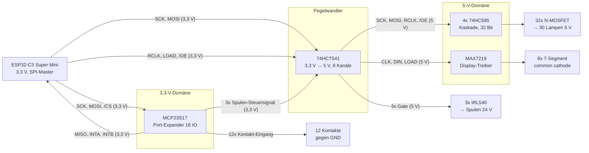

# Steuerplatine Kegelautomat – Funktionsweise & Portbelegung

**Projekt:** Nachbau der Steuerung eines Wandkegelautomaten „Bowling de Luxe / Mini Sport Kegler" (Fa. Dibisch, ~1970er)
**Zentrale Steuerung:** ESP32-C3 Super Mini
**Stand:** 2026-07-12

---

## 1. Übersicht & Zielsetzung

Der Automat ist ein Wandgerät, bei dem mit einem Hebel Kugeln „eingeschossen" werden, um möglichst viele Kegel umzuwerfen. Die Steuerplatine bildet den originalen Spielablauf nach. Anzusteuern / auszuwerten sind:

| Menge | Element | Elektrische Eigenschaft |
|------:|---------|-------------------------|
| 30×   | Lampen (Kegel-Symbole u. a.) | 5 V, geschaltet gegen **GND** (Low-Side) |
| 12×   | Kontakte (Einzelkontakte, keine Matrix) | schalten gegen **GND** |
| 3×    | Spulen (Münz-Weiche) | 24 V, geschaltet gegen **GND** (Low-Side) |
| 8×    | 7-Segment-Displays (Punkte) | **common cathode** |

**Ergebnis der Verifikation:** Alle Komponenten sind mit dem ESP32-C3 steuerbar. Die vier Peripherie-Typen werden über **einen gemeinsamen SPI-Bus** bedient; ein **74HCT541** pegelt die 3,3-V-Ausgänge des ESP32 auf 5 V für die 5-V-Bausteine. Details und die drei elektrischen Fallstricke (mit Lösung) siehe Abschnitt 3.

---

## 2. Systemarchitektur

Der ESP32-C3 ist SPI-Master. Alle Bausteine teilen sich **SCK** und **MOSI**; nur der MCP23S17 nutzt zusätzlich **MISO** (Kontakte zurücklesen). Jeder Baustein hat eine eigene Latch-/Chip-Select-Leitung.

**Warum ein gemeinsamer Bus funktioniert:** Nur der Baustein, dessen Latch-/CS-Leitung aktiviert wird, übernimmt die Daten. Der 74HC595 hat kein Chip-Select – siehe Betriebs­hinweis in Abschnitt 10.

---

## 3. Spannungsdomänen & Pegelkonzept

Die Platine hat **drei Spannungsdomänen**:

| Domäne | Versorgt | Anmerkung |
|--------|----------|-----------|
| 3,3 V  | ESP32-C3, MCP23S17 | Logik-Master |
| 5 V    | 74HCT541, 4×74HC595, MAX7219, Lampen | Treiber & Anzeige |
| 24 V   | Spulen (über IRL540) | nur Leistungspfad |

### 3.1 Das Kernproblem: 3,3-V-Logik an 5-V-Bausteinen

Der ESP32-C3 gibt an seinen GPIOs nur **3,3 V** aus. Mehrere 5-V-Bausteine verlangen aber eine höhere High-Schwelle (V_IH). Aus den Datasheets:

| Baustein | V_IH (min, garantiert) | Bei 3,3 V vom ESP? | Quelle |
|----------|------------------------|--------------------|--------|
| **MAX7219** (V+ = 5 V) | **3,5 V** | ✗ unter Schwelle (out of spec) | `max7219-max7221.pdf`, Electrical Characteristics |
| **74HC595** (VCC = 5 V) | ≈ **3,5 V** (0,7·VCC) | ✗ grenzwertig | 74HC595 Standard-Datasheet |
| **MCP23S17** (VDD = 5 V) | **0,8·VDD = 4,0 V** | ✗ unsicher | `MCP23S17_MIC.pdf`, DC Characteristics (D041) |
| **MCP23S17** (VDD = 3,3 V) | **0,8·VDD = 2,64 V** | ✓ sicher | ″ |

### 3.2 Lösungskonzept

1. **MCP23S17 mit 3,3 V betreiben.** Dann liegt V_IH bei 2,64 V → die 3,3-V-SPI-Signale des ESP werden sicher erkannt. Die SPI-Leitungen zum MCP gehen **direkt** (ungepuffert), MISO/INTA/INTB kommen mit 3,3 V zurück (ESP-konform). Betriebsspannungs­bereich des MCP23S17: 1,8–5,5 V (Datasheet), 3,3 V ist zulässig.

2. **74HCT541 als Pegelwandler 3,3 V → 5 V** für alle Leitungen, die in die 5-V-Bausteine gehen. Der HCT-Eingang erkennt 3,3 V sicher als High (V_IH,HCT = 2,0 V) und treibt am Ausgang volle 5 V. Das löst **MAX7219** und **74HC595** in einem Rutsch.

3. **595 mit 5 V betreiben** – dadurch liefern die 595-Ausgänge 5 V an die Lampen-MOSFET-Gates (sauberes Durchschalten der Logic-Level-MOSFETs).

4. **IRL540-Gate-Ansteuerung ebenfalls über den 74HCT541.** Die Spulen-Steuersignale kommen als 3,3-V-Ausgang aus dem MCP23S17 und werden im 74HCT541 auf 5 V gepegelt → volle Gate-Spannung an den IRL540. Das behebt die grenzwertige 3,3-V-Gate-Ansteuerung.

> **Ergebnis:** Der eine 74HCT541 ist mit **genau 8 von 8 Kanälen** belegt: 5 Steuerleitungen (SCK, MOSI, RCLK, LOAD, /OE) + 3 Spulen-Gate-Signale. Siehe Abschnitt 6.

---

## 4. ESP32-C3: GPIO-Eigenschaften & Boot-Beschränkungen

Die ESP32-C3-Super-Mini-Platine führt **13 GPIOs** heraus: **0–10, 20, 21**. Beim Belegen sind folgende Eigenschaften (geprüft gegen die Espressif-Doku) zu beachten:

| GPIO | Besonderheit | Konsequenz für dieses Projekt |
|------|--------------|-------------------------------|
| **GPIO2** | **Strapping-Pin** – muss beim Boot HIGH sein | nur mit Pull-up nutzbar → als 595-`/OE` (HIGH = Lampen aus beim Boot) |
| **GPIO8** | **Strapping-Pin** + **Onboard-LED** (active-low) | für Peripherie meiden → frei als Status-LED |
| **GPIO9** | **Strapping-Pin** + **BOOT-Taster** (interner Pull-up) | reservieren (Programmier-/Boot-Auswahl) |
| GPIO0–5 | ADC- und RTC-fähig | als Digital-IO uneingeschränkt nutzbar |
| GPIO11–17 | **SPI-Flash** (nicht herausgeführt) | nicht verwendbar |
| GPIO18/19 | **USB D-/D+** (nativ, nicht am Header) | für USB-CDC (Programmierung/Log) |
| GPIO20/21 | **UART0** TX/RX | bleiben frei für Debug (USB-CDC vorhanden) |

**Wichtig:**
- Strapping-Pins (GPIO2, 8, 9) beim Boot **nie auf LOW** ziehen.
- Der ESP32-C3 hat **keine Input-only-Pins** (anders als der klassische ESP32) – alle herausgeführten GPIOs sind bidirektional.

---

## 5. ESP32-C3 Portbelegung

| GPIO | Signal | Richtung | Verbindung | Hinweis |
|------|--------|:--------:|------------|---------|
| **GPIO4** | SPI **SCK** | OUT | → 74HCT541 (→595/MAX) **und** direkt → MCP | Hardware-SPI-Takt |
| **GPIO6** | SPI **MOSI** | OUT | → 74HCT541 (→595/MAX) **und** direkt → MCP | |
| **GPIO5** | SPI **MISO** | IN | ← MCP23S17 SO (3,3 V) | nur MCP treibt MISO |
| **GPIO7** | **MCP /CS** | OUT | → MCP23S17 CS (3,3 V) | Pull-up nach 3,3 V |
| **GPIO10** | **MAX7219 LOAD** | OUT | → 74HCT541 → MAX7219 | |
| **GPIO3** | **74HC595 RCLK** | OUT | → 74HCT541 → 595 (Storage-Clock) | |
| **GPIO1** | **MCP INTA** | IN | ← MCP23S17 INTA (Port A) | Interrupt Kontakte 1–8 |
| **GPIO0** | **MCP INTB** | IN | ← MCP23S17 INTB (Port B) | Interrupt Kontakte 9–12 |
| **GPIO2** | **74HC595 /OE** | OUT | → 74HCT541 → 595 (Output Enable) | Strapping: Pull-up → HIGH=Lampen aus beim Boot |
| GPIO8 | (Onboard-LED / Status) | OUT | Onboard-LED | frei für Statusanzeige |
| GPIO9 | BOOT | — | BOOT-Taster | reserviert |
| GPIO20 | UART0 RX | — | Debug | frei |
| GPIO21 | UART0 TX | — | Debug | frei (alternativer /OE-Pin) |

**Festverdrahtete Steuerpins (kein GPIO nötig):**
- MCP23S17 `/RESET` → fest auf **3,3 V** (Pull-up 10 kΩ).
- 74HC595 `/SRCLR` (Master Reset) → fest auf **5 V**.
- 74HCT541 `/OE1`, `/OE2` (Pin 1 + 19) → **GND** (Buffer immer aktiv).

> 9 GPIOs sind belegt, 4 bleiben frei (GPIO8, 9, 20, 21). GPIO4/5/6/7 nutzen die Hardware-SPI-Zuordnung des Boards (SCK/MISO/MOSI/SS).

---

## 6. 74HCT541 – Kanalbelegung (Pegelwandler 3,3 V → 5 V)

Oktal-Buffer, nicht invertierend. Eingänge 3,3-V-tauglich (HCT), Ausgänge treiben 5 V. Versorgung: **5 V**. `/OE1` (Pin 1) und `/OE2` (Pin 19) auf GND.

| Kanal | Eingang (3,3 V) von | Ausgang (5 V) nach | Funktion |
|:-----:|---------------------|--------------------|----------|
| 1 | ESP GPIO4 (SCK) | 595 SRCLK + MAX CLK | SPI-Takt |
| 2 | ESP GPIO6 (MOSI) | 595 SER + MAX DIN | SPI-Daten |
| 3 | ESP GPIO3 (RCLK) | 595 RCLK | Lampen-Latch |
| 4 | ESP GPIO10 (LOAD) | MAX7219 LOAD | Display-Latch |
| 5 | ESP GPIO2 (/OE) | 595 /OE | Lampen-Blanking |
| 6 | MCP GPB5 | IRL540 #1 Gate | Spule 1 |
| 7 | MCP GPB6 | IRL540 #2 Gate | Spule 2 |
| 8 | MCP GPB7 | IRL540 #3 Gate | Spule 3 |

Alle 8 Kanäle belegt. Die Mischung aus schnellem SPI-Takt und langsamen DC-Spulen­signalen in einem Baustein ist unkritisch.

---

## 7. 74HC595-Kaskade – Lampen (32 Ausgänge, 30 genutzt)

**Aufbau:** 4× 74HC595 in Reihe (QH' → SER des nächsten) = **32-Bit-Schieberegister**. Versorgung **5 V**. Jeder Ausgang treibt das Gate eines kleinen **Logic-Level-N-MOSFET** (z. B. 2N7002 / AO3400), der die zugehörige Lampe **low-side** gegen GND schaltet. Lampen-Pluspol liegt fest auf 5 V.

**Signale:**
- `SER` ← 74HCT541 (MOSI, 5 V)
- `SRCLK` ← 74HCT541 (SCK, 5 V) – Schiebetakt
- `RCLK` ← 74HCT541 (GPIO3, 5 V) – Übernahme ins Ausgangs-Latch
- `/OE` ← 74HCT541 (GPIO2, 5 V) – LOW = Ausgänge aktiv, HIGH = alle Ausgänge hochohmig
- `/SRCLR` → fest 5 V

**Bit-Zuordnung (Vorschlag):**

| 595 | Bit (Q) | Lampen |
|-----|---------|--------|
| IC1 (erstes im Bus) | Q0…Q7 | Lampe 1–8 |
| IC2 | Q0…Q7 | Lampe 9–16 |
| IC3 | Q0…Q7 | Lampe 17–24 |
| IC4 (letztes) | Q0…Q7 | Lampe 25–30, **Q6/Q7 = Reserve** |

> **30 von 32 Ausgängen genutzt**, 2 Reserve. (Der Automat hat 30 Lampen, die Skizze führt sie über 3×10er-Stecker + einen 4er-Block heraus.)

**Wichtig – definierter Aus-Zustand:**
- Jedes MOSFET-Gate braucht einen **Pulldown (z. B. 100 kΩ)** nach GND. Solange `/OE` HIGH ist (Boot) sind die 595-Ausgänge hochohmig – der Pulldown hält das Gate sicher LOW → Lampe aus.
- **5-V-Strombudget:** 30 Lampen × Lampenstrom. Bei z. B. 100 mA/Lampe = bis zu 3 A. Das 5-V-Netzteil und die Leiterbahnen entsprechend dimensionieren (siehe Abschnitt 12).

**Optional:** Über PWM auf `/OE` (GPIO2) lässt sich die globale Lampenhelligkeit dimmen.

---

## 8. MAX7219 – Displays (8× 7-Segment, common cathode)

Der MAX7219 ist ein serieller Anzeigentreiber für bis zu **8 Digits common cathode** – passt exakt zu den 8 Punktedisplays. Versorgung **V+ = 5 V** (Bereich 4,0–5,5 V).

**Signale (alle 5 V, aus dem 74HCT541):**
- `DIN` ← MOSI
- `CLK` ← SCK
- `LOAD` ← GPIO10

**Beschaltung / Konfiguration:**
- **RSET** zwischen V+ und ISET setzt den Segment-Spitzenstrom; Minimum 9,53 kΩ (≈ 40 mA). Wert nach gewünschter Helligkeit / Display-Datenblatt wählen.
- **Scan-Limit-Register** = 7 (→ 8 Digits aktiv).
- **Decode-Mode**: Code-B für reine Ziffernanzeige, oder No-Decode für individuelle Segmentsteuerung.
- **Intensity-Register**: digitale Helligkeit (16 Stufen).
- **Shutdown-Register**: nach Power-up ist die Anzeige geblankt – im Setup aktiv schalten.

**Hinweis Logikpegel:** Die 5-V-Ansteuerung über den 74HCT541 stellt sicher, dass die 3,5-V-V_IH-Schwelle des MAX7219 sicher überschritten wird (siehe Abschnitt 3). Ohne den Pegelwandler wäre der Betrieb mit 3,3 V außerhalb der Spezifikation.

---

## 9. MCP23S17 – Kontakte & Spulen

SPI-Port-Expander mit **16 IO** (Port A: GPA0–7, Port B: GPB0–7). Versorgung **3,3 V** (damit 3,3-V-SPI direkt funktioniert, siehe Abschnitt 3). SPI-Signale (SCK, SI=MOSI, SO=MISO, CS) **ungepuffert** direkt zum ESP.

### 9.1 IO-Belegung

| Pin | Funktion | Richtung | Beschaltung |
|-----|----------|:--------:|-------------|
| GPA0–GPA7 | Kontakt 1–8 | IN | interner Pull-up, schaltet gegen GND |
| GPB0–GPB3 | Kontakt 9–12 | IN | interner Pull-up, schaltet gegen GND |
| GPB4 | **Reserve** | – | frei |
| GPB5 | Spule 1 | OUT | → 74HCT541 → IRL540 #1 |
| GPB6 | Spule 2 | OUT | → 74HCT541 → IRL540 #2 |
| GPB7 | Spule 3 | OUT | → 74HCT541 → IRL540 #3 |

> **Bilanz:** 12 Eingänge + 3 Ausgänge = 15 IO → **1 IO Reserve** (GPB4).
> Hinweis: In der Projektbeschreibung steht „3 Reserve"; rechnerisch ist es bei 12 Kontakten + 3 Spulen **1 Reserve**.

### 9.2 Kontakt-Erfassung per Interrupt

- Alle 12 Eingänge mit **internem Pull-up** (`GPPU` = 1). Ein geschlossener Kontakt zieht den Pin auf GND.
- **Interrupt-on-Change** (`GPINTEN` = 1, Vergleich gegen Vorwert) meldet jede Kontakt­änderung.
- **INTA** bündelt Port-A-Änderungen (Kontakt 1–8), **INTB** die von Port B (Kontakt 9–12). Konfiguration: INT-Pins **nicht** gespiegelt (`MIRROR` = 0), damit A/B getrennt bleiben.
- Der ESP reagiert auf die INT-Flanke (GPIO1/GPIO0) und liest per SPI `INTF`/`INTCAP`/`GPIO`.

### 9.3 Spulen-Leistungsteil (IRL540)

- MCP-Ausgang HIGH → 74HCT541 (5 V) → **IRL540-Gate** → Spule (24 V) low-side eingeschaltet.
- **Gate-Pulldown (z. B. 10 kΩ)** je IRL540 → definierter Aus-Zustand bei Boot / vor Firmware-Init (MCP-Ausgänge sind nach Reset hochohmige Eingänge).
- **Freilaufdiode zwingend** je Spule (z. B. UF4007/1N4007, Kathode an +24 V, Anode an Drain) – schützt den IRL540 vor der Induktions­spannung beim Abschalten.

---

## 10. SPI-Bus-Betrieb (gemeinsamer Bus)

Alle Bausteine arbeiten im **SPI-Mode 0** (CPOL=0, CPHA=0). SCK und MOSI sind gemeinsam.

**Chip-Select / Latch je Baustein:**
- **MCP23S17**: echtes `/CS` (GPIO7). Reagiert nur bei aktivem CS → unkritisch.
- **MAX7219**: `LOAD`. Schiebt zwar bei jedem CLK, übernimmt Daten aber erst mit steigender `LOAD`-Flanke.
- **74HC595**: **kein Chip-Select.** Das Schieberegister taktet bei **jedem** SCK mit – auch während MCP-/MAX-Transfers wird „Müll" eingeschoben. **Das ist unkritisch**, solange `RCLK` (Übernahme ins Ausgangs-Latch) nicht gepulst wird.

**Betriebsregel für die Lampen:** Vor jedem `RCLK`-Puls **immer das vollständige 32-Bit-Lampen­muster frisch einschieben**. Dann ist egal, was zwischenzeitlich durch andere Transfers in die 595 gelangt ist – erst der letzte, vollständige Frame vor `RCLK` wird sichtbar.

**MISO-Bus:** Nur der MCP23S17 treibt MISO (und nur bei aktivem CS). MAX7219-`DOUT` und 595-`QH'` werden **nicht** auf den ESP-MISO geführt → keine Bus-Kollision.

---

## 11. Boot- & Sicherheitsverhalten

Definierte, ungefährliche Zustände von Power-on bis Firmware-Init:

| Element | Maßnahme | Zustand beim Boot |
|---------|----------|-------------------|
| Lampen | GPIO2 (`/OE`) per Pull-up HIGH → 595-Ausgänge hochohmig + Gate-Pulldowns | **alle aus** |
| Spulen | IRL540-Gate-Pulldowns; MCP-Ausgänge nach Reset hochohmig | **alle aus** |
| Display | MAX7219 startet im Shutdown (Datasheet) | **dunkel** |
| MCP | `/RESET` fest auf 3,3 V; Register-Defaults = alle Pins Eingang | keine ungewollten Ausgänge |
| Strapping | GPIO2 (Pull-up HIGH), GPIO8/9 unbeschaltet von Peripherie | normaler Flash-Boot |

---

## 12. Offene Punkte & Empfehlungen

1. **5-V-Netzteil dimensionieren** – bestimmt durch den Summenstrom der 30 Lampen (Lampenstrom messen). Reserve einplanen.
2. **Freilaufdioden** an allen 3 Spulen nicht vergessen (24 V, induktiv).
3. **IRL540 real prüfen:** Spulenstrom messen und gegen die Transfer-Kennlinie bei V_GS = 5 V gegenchecken. Bei hohen Strömen ggf. auf einen MOSFET mit niedrigerem R_DS(on) bei 5 V wechseln.
4. **Entkopplung:** je IC 100 nF nahe an VCC/VDD; zusätzlich Elkos an den 5-V- und 24-V-Rails. Getrennte GND-Führung (Leistungs-GND der Lampen/Spulen sternförmig zum Logik-GND).
5. **„3 Reserve"** aus der Projektbeschreibung → tatsächlich **1 Reserve** am MCP23S17 (12 Kontakte + 3 Spulen = 15 von 16 IO).
6. **Kontakte physisch:** laut Skizze zwei Steckerleisten (1×10, 1×4). Endgültige Pin-Zuordnung der 12 Kontakte auf die Stecker in der Verdrahtungsdoku festlegen.
7. **Alternative /OE-Belegung:** Wer die Strapping-Pins komplett meiden will, legt 595-`/OE` auf **GPIO21** (UART0-TX, idle HIGH) statt GPIO2 – dann per externem Pull-up das Boot-Blanking sichern.

---

## Anhang: Verwendete Quellen

- `Projekt_Kegelautomat.txt` – Projektbeschreibung
- `datasheets/MCP23S17_MIC.pdf` – DC-Kennwerte (V_IH = 0,8·VDD; Betrieb 1,8–5,5 V; max. 25 mA/Pin)
- `datasheets/max7219-max7221.pdf` – Electrical Characteristics (V_IH = 3,5 V @ V+ = 5 V; common cathode; 8 Digits)
- `datasheets/Development Board ESP32 C3 Sup.png` – Pinout Super Mini
- `datasheets/PCB_Skizze.jpg`, `datasheets/Kegelautomat.jpg` – Layout-Skizze & Automat
- Espressif ESP32-C3 GPIO-Doku – Strapping-Pins GPIO2/8/9, GPIO11–17 Flash, GPIO18/19 USB
